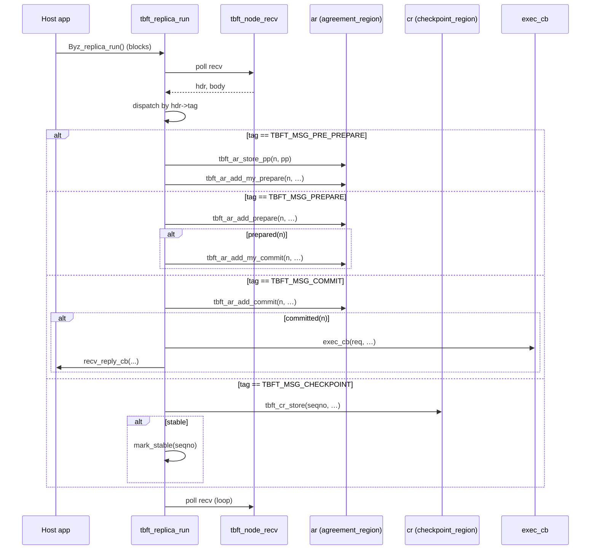

<!-- docs/03-architecture-overview.md — generated by ultracode docs workflow. Do not edit by hand. -->

# Architecture Overview

TinyBFT is a PBFT (Practical Byzantine Fault Tolerance) implementation
optimised for ESP32-class MCUs. The component is layered so that a host
application consumes a small `Byz_*` API, the BFT state machine manages
all consensus logic over statically-allocated message regions, and the
transport / crypto layers are interchangeable. Memory is reserved at
compile time and sized by Kconfig; the steady-state path performs no
heap allocation.

## Contents

- [Layer diagram](#layer-diagram)
- [Public API surface](#public-api-surface)
- [Module responsibilities](#module-responsibilities)
- [Replica struct (`tbft_replica_t`)](#replica-struct-tbft_replica_t)
- [Node struct (`tbft_node_t`) and embedding rule](#node-struct-tbft_node_t-and-embedding-rule)
- [Lifecycle: init → run → shutdown](#lifecycle-init--run--shutdown)
- [Cross-references](#cross-references)

## Layer diagram

```text
+-------------------------------------------------------------------+
| Host application (examples/counter, examples/simple_wallet)       |
|   - app_state, exec_cb, comp_ndet_cb, recv_reply_cb                |
+-------------------------------------------------------------------+
                          |
                          v   Byz_init_replica / Byz_replica_run / Byz_*
+-------------------------------------------------------------------+
|  include/esp-tinybft.h          (public API, libbyz-compatible)   |
+-------------------------------------------------------------------+
                          |
                          v
+-------------------------------------------------------------------+
|  src/tbft_libbyz.c              (API impl, config parser)         |
+-------------------------------------------------------------------+
                          |
                          v
+-------------------------------------------------------------------+
|  src/tbft_replica.c / .h        (PBFT state machine, dispatch)    |
|   - request handling, view-changes, fetch, key rotation, timers   |
+-------------------------------------------------------------------+
            |                  |                  |
            v                  v                  v
+-----------------+  +------------------+  +-------------------+
| tbft_node.c / .h|  | tbft_view_info.* |  | tbft_state.c / .h |
| (transport +    |  | (view-change     |  | (Merkle partition |
|  crypto glue)   |  |  collection)     |  |  tree, CoW, ckpts)|
+-----------------+  +------------------+  +-------------------+
            |
   +--------+---------+-----------+------------+
   |                  |           |            |
   v                  v           v            v
+----------+  +--------------+ +-------+ +----------------+
| Static   |  | tbft_        | | Crypto| | Transport      |
| regions  |  | certificate.*| | layer | | (UDP/ESP-NOW)  |
|----------|  | (quorum)     | |       | |                |
| ar       |  +--------------+ | tbft_ | +----------------+
| cr       |                   | prin- |     |          |
| sr       |                   | cipal |     v          v
| rqueues  |                   |  .c   |  tbft_      tbft_
| ndet_buf |                   +-------+  transport_ transport_
| out_buf  |                              udp.c     espnow.c
+----------+
```

The top three boxes are the user-visible surface. Everything below
`tbft_replica.c` is internal and never reached directly by the host app.

## Public API surface

The public surface lives in `include/esp-tinybft.h:80-294` and is divided
into client and replica functions. All entry points use the `Byz_`
prefix and are wrapped in `extern "C"` for C++ compatibility.

| Function | Header line | Purpose |
|----------|-------------|---------|
| `Byz_init_client` | `esp-tinybft.h:150` | Initialise a BFT client (parses config, builds principal table, opens transport) |
| `Byz_alloc_request` | `esp-tinybft.h:160` | Allocate a request buffer of `size` bytes |
| `Byz_send_request` | `esp-tinybft.h:169` | Send a populated request to the primary |
| `Byz_recv_reply` | `esp-tinybft.h:177` | Wait for `f+1` matching replies |
| `Byz_invoke` | `esp-tinybft.h:184` | Convenience: send + receive in one call |
| `Byz_invoke_with_retry` | `esp-tinybft.h:209` | Invoke with bounded retry and exponential backoff |
| `Byz_free_request` | `esp-tinybft.h:213` | Free a `Byz_req` |
| `Byz_free_reply` | `esp-tinybft.h:216` | Free a `Byz_rep` |
| `Byz_reset_client` | `esp-tinybft.h:219` | Reset pending client state |
| `Byz_init_replica` | `esp-tinybft.h:245` | Initialise a BFT replica (parses config, wires transport, allocates regions) |
| `Byz_modify` | `esp-tinybft.h:260` | Notify library that a state region is about to be modified |
| `Byz_modify1` | `esp-tinybft.h:266` | Same, for a single block |
| `Byz_replica_run` | `esp-tinybft.h:272` | Run the replica event loop (blocks) |
| `Byz_detect_local_id` | `esp-tinybft.h:287` | Auto-detect local node id from MAC or IP |
| `Byz_reset_stats` | `esp-tinybft.h:290` | Reset performance counters |
| `Byz_print_stats` | `esp-tinybft.h:293` | Print current performance stats |

### Callback signatures

Three callbacks are passed to `Byz_init_replica`:

| Type | Header line | Signature |
|------|-------------|-----------|
| `Byz_exec_cb` | `esp-tinybft.h:117` | `int (*)(Byz_req *in, Byz_rep *out, Byz_buffer *ndet, int cid, bool ro)` |
| `Byz_comp_ndet_cb` | `esp-tinybft.h:127` | `void (*)(int64_t seqno, Byz_buffer *ndet, int max_len)` |
| `Byz_recv_reply_cb` | `esp-tinybft.h:133` | `void (*)(Byz_rep *reply, int cid)` |

Buffer types `Byz_req`, `Byz_rep`, `Byz_buffer` are plain `{contents, size}`
pairs declared at `esp-tinybft.h:84-99`.

## Module responsibilities

The `src/` directory contains the following files. Each paragraph
describes the responsibility and the major symbols it exports.

### `tbft_libbyz.c`

Implements the `Byz_*` API. Owns the `static tbft_replica_t g_replica`
and `static tbft_node_t g_node` singletons, the `parse_config` routine
that reads the SPIFFS config file, and the trampolines between the
public API and the replica / node functions. Calls
`tbft_replica_init` then `tbft_replica_run` from `Byz_replica_run`.

### `tbft_replica.c` / `tbft_replica.h`

The PBFT state machine. Owns message dispatch in `tbft_replica_run`
(`tbft_replica.c`, the `for(;;)` loop), all `handle_*` functions
(`tbft_replica_handle_request` through `tbft_replica_handle_fill_request`,
`tbft_replica.h:205-228`), and the protocol actions
(`tbft_replica_send_pre_prepare`, `_send_prepare`, `_send_commit`,
`_execute_committed`, `_mark_stable`, `_send_view_change`, `_send_new_key`
in `tbft_replica.h:235-253`). Hosts the three static memory regions
(`ar`, `cr`, `sr`) by value.

### `tbft_node.c` / `tbft_node.h`

The base for all PBFT participants. Owns the local node's identity
(`node_id`, `local_principal`), the principals array, the transport
pointer, the receive buffer `recv_buf[TBFT_MAX_MESSAGE_SIZE]`
(`tbft_node.h:42`), the authentication freshness timer, and the
monotonic `rid_counter` (`tbft_node.h:49`). Provides `tbft_node_send`,
`tbft_node_recv`, `tbft_node_gen_auth`, `tbft_node_verify_auth`,
`tbft_node_gen_sig`, `tbft_node_verify_sig`, and the inline helpers
`tbft_node_primary` and `tbft_node_is_replica` (`tbft_node.h:170-182`).

### `tbft_principal.c` / `tbft_principal.h`

Per-peer crypto state. Each `tbft_principal_t` holds a long-term RSA
public key (DER), a session HMAC in-key and out-key
(`tbft_hmac_key_t` of 32 bytes each, `tbft_types.h:44-47`), and PSA
handles for the imported key. Implements HMAC-SHA256 verification for
the hot path and RSA-2048 sign/verify for the slow path
(Request, View_change, New_view).

### `tbft_agreement_region.c` / `tbft_agreement_region.h`

Static circular buffer for in-flight Pre_prepare / Prepare / Commit
messages. Holds `TBFT_WINDOW_SIZE` `tbft_agreement_slice_t` entries
(`tbft_agreement_region.h:30-37`). Exposes `tbft_ar_init`,
`tbft_ar_store_pp`, `tbft_ar_load_pp`, `tbft_ar_add_prepare`,
`tbft_ar_add_my_prepare`, `tbft_ar_prepared`, `tbft_ar_add_commit`,
`tbft_ar_add_my_commit`, `tbft_ar_committed`, and `tbft_ar_truncate`
(see [07-static-memory-model.md](07-static-memory-model.md) for the
indexing math).

### `tbft_checkpoint_region.c` / `tbft_checkpoint_region.h`

Static storage for Checkpoint messages. Owns `slots[TBFT_NUM_CKPT_SLOTS]`
and `above_window[TBFT_MAX_NUM_REPLICAS]` (`tbft_checkpoint_region.h:43-48`).
Implements multi-candidate digest tracking so a Byzantine replica cannot
permanently poison `winning_digest` by arriving first
(`tbft_checkpoint_region.c:49-83`). Exposes `tbft_cr_init`,
`tbft_cr_store`, `tbft_cr_load`, `tbft_cr_count`,
`tbft_cr_winning_digest`, `tbft_cr_store_above_window`,
`tbft_cr_load_above_window`, `tbft_cr_truncate`.

### `tbft_special_region.c` / `tbft_special_region.h`

Static storage for non-hot-path messages: View_change (one per
replica), View_change_ack (`[sender][vc_sender]` matrix), New_view
(one), New_key (one), Request cache (one per client), Reply cache (one
per client). All slots use the `TBFT_SR_SLOT(max_size)` macro
(`tbft_special_region.h:31-32`) which produces
`{ uint8_t buf[max_size]; int len; bool valid; }`.

### `tbft_view_info.c` / `tbft_view_info.h`

Tracks view-change protocol state. Stores `target_view`, a per-replica
`received[]` bitmap, `last_stable[]` array, and a back-pointer to the
special region (`tbft_view_info.h:17-35`). Exposes `tbft_vi_init`,
`tbft_vi_reset`, `tbft_vi_collect_vc`, `tbft_vi_has_quorum`,
`tbft_vi_compute_min_max`, `tbft_vi_verify_nv`, `tbft_vi_collect_vc_ack`.

### `tbft_state.c` / `tbft_state.h`

Application state storage: copy-on-write bitmap (`cowb[]`),
`block_digests[]`, `ckpt_records[]`, `last_stable`. Implements
`tbft_state_init`, `tbft_state_modify`, `tbft_state_modify1`,
`tbft_state_checkpoint`, `tbft_state_start_fetch`, the partition tree
walk, and the Meta_data/Data/Fetch handlers.

### `tbft_certificate.c` / `tbft_certificate.h`

Quorum certificates. Uses the `CERT_IMPL` macro to generate three
identical implementations — `tbft_commit_cert_t`,
`tbft_checkpoint_cert_t`, `tbft_prepare_cert_t` — each tracking
`TBFT_CERT_MAX_VALS` distinct values with a `tbft_bitmap_t` of senders
(`tbft_certificate.h:42-55`).

### `tbft_prepared_cert.c` / `tbft_prepared_cert.h`

Combines a stored Pre_prepare (up to `TBFT_MAX_MESSAGE_SIZE` bytes) with
a `tbft_prepare_cert_t`. Complete when the Pre_prepare is present, the
prepare certificate has `2f` matches, and the digests match
(`tbft_prepared_cert.h:20-30`).

### `tbft_message.c` / `tbft_message.h`

All wire-format rep structs (Request, Reply, Pre_prepare, Prepare,
Commit, Checkpoint, Status, View_change, New_view, View_change_ack,
New_key, Meta_data, Meta_data_d, Data, Fetch, Query_stable,
Reply_stable, Fill_request) and the `tbft_msg_hdr_t` common header
(`tbft_message.h:37-42`). The 17 message tags (1-17, with Fill_request
at 18) are listed in `tbft_message.h:11-30`. Also provides
`tbft_msg_digest` and `tbft_digest_equal`.

### `tbft_transport_udp.c`

UDP backend. Multicast-capable, unbounded payload. Owns a single
`recv_task` that calls `tbft_node_recv` via a FreeRTOS queue.

### `tbft_transport_espnow.c`

ESP-NOW backend. Hard 1470-byte per-packet limit. Implements automatic
fragmentation (4-byte header: `msg_id`, `frag_idx`, `frag_total`) and
reassembly (4 concurrent slots, 5 s timeout). Runs `esp_now_recv_cb` in
the WiFi task context.

### `tbft_partition.c` / `tbft_partition.h`

Merkle partition tree used by the state transfer protocol
(`TBFT_P_CHILDREN` children per internal node, `TBFT_P_LEVELS` deep).

### `tbft_itimer.c` / `tbft_itimer.h`

Wraps `esp_timer_handle_t`. Each timer signals the replica's
`EventGroupHandle_t` rather than executing work directly; heavy
processing runs in the main `tbft_replica_run` loop.

### `tbft_config.h`

All compile-time protocol constants, sourced from Kconfig with
`#ifndef` override guards. Derived constants: `TBFT_DIGEST_SIZE=32`,
`TBFT_HMAC_SIZE=32`, `TBFT_SIG_SIZE=256`, `TBFT_AUTH_SIZE`,
`TBFT_NUM_CKPT_SLOTS`, `TBFT_MAX_FAULTY`, `TBFT_CERT_MAX_VALS`,
`TBFT_P_CHILDREN`. Enforces nine compile-time `_Static_assert`s
(`tbft_config.h:111-143`).

### `tbft_log.h`

`ESP_LOGI` / `ESP_LOGE` / `ESP_LOGW` wrapper with per-file `TAG`
constants.

## Replica struct (`tbft_replica_t`)

The replica struct is the central state object. Defined in
`tbft_replica.h:58-150`, it is a single statically-allocated value (no
pointer to heap). Top-level layout:

```text
+------------------------------------------------------------------+
| tbft_replica_t                                                   |
|------------------------------------------------------------------|
| tbft_node_t           node           (MUST be first member)      |
| tbft_seqno_t          seqno                                       |
| int                   last_assigned_cid                           |
| tbft_req_id_t         last_assigned_rid                           |
| tbft_seqno_t          last_stable                                 |
| tbft_seqno_t          quorum_last_stable                          |
| int64_t               last_ckpt_throttle_us                       |
| int64_t               last_fetch_throttle_us                      |
| tbft_seqno_t          last_prepared                               |
| tbft_seqno_t          last_executed                               |
| tbft_seqno_t          last_tentative_execute                      |
| tbft_seqno_t          pending_fill_seqno                          |
| int64_t               fill_started_at_us                          |
| tbft_req_id_t         last_received_rid[N]                        |
| tbft_req_id_t         last_executed_rid[N]                        |
| tbft_req_id_t         last_forwarded_rid[N]                       |
| tbft_rqueue_t         rqueue                                      |
| tbft_rqueue_t         ro_rqueue                                   |
| tbft_agreement_region_t   ar                                      |
| tbft_checkpoint_region_t  cr                                     |
| tbft_special_region_t     sr                                      |
| tbft_state_t          state                                       |
| tbft_view_info_t      vi                                          |
| tbft_itimer_t         vtimer                                      |
| tbft_itimer_t         stimer                                      |
| int64_t               vtimer_period_us                            |
| int64_t               stimer_period_us                            |
| tbft_exec_cb_t        exec_cb                                     |
| tbft_comp_ndet_cb_t   comp_ndet_cb                                |
| tbft_recv_reply_cb_t  recv_reply_cb                               |
| int                   ndet_max_len                                |
| uint8_t               ndet_buf[TBFT_NDET_BUF_SIZE]                |
| uint8_t               out_buf[TBFT_MAX_MESSAGE_SIZE]              |
| volatile bool         running                                     |
| int                   yield_counter                               |
| int                   consecutive_mac_failures                    |
| int64_t               view_installed_us                           |
| tbft_seqno_t          view_start_executed                         |
| EventGroupHandle_t    evt_group                                   |
+------------------------------------------------------------------+
```

The `N` in the rid arrays is `TBFT_MAX_NUM_REPLICAS + TBFT_MAX_NUM_CLIENTS`
(`tbft_replica.h:82-84`). `evt_group` carries the `TBFT_EVT_VTIMER` and
`TBFT_EVT_STIMER` bits (`tbft_replica.h:152-153`).

## Node struct (`tbft_node_t`) and embedding rule

`tbft_node_t` is the base type for any PBFT participant. It owns the
crypto identity, the principal table, and the transport. Defined in
`tbft_node.h:20-50`:

```text
+---------------------------------------------------+
| tbft_node_t                                       |
|---------------------------------------------------|
| tbft_node_id_t   node_id                          |
| int              max_faulty          (f)          |
| int              num_replicas                     |
| int              threshold           (2f+1)       |
| tbft_view_t      view                             |
| int              cur_primary                      |
| tbft_principal_t *principals[N+clients]           |
| int              num_principals                   |
| tbft_principal_t *local_principal                 |
| tbft_transport_t *transport                       |
| uint8_t          recv_buf[TBFT_MAX_MESSAGE_SIZE]   |
| tbft_itimer_t    atimer                           |
| int64_t          auth_timeout_us                  |
| uint64_t         rid_counter                      |
+---------------------------------------------------+
```

### Embedding rule

`tbft_replica_t::node` is the first member of the replica struct
(`tbft_replica.h:59` carries the comment `MUST be first — pointer
aliasing with node`). This is enforced by C struct-layout rules: a
pointer to a struct whose first member is of type `T` can be safely
cast to `T *` and back. The result is that `tbft_replica_t *r` and
`&r->node` (a `tbft_node_t *`) are bit-identical, so transport
callbacks, crypto helpers, and shared code that takes a `tbft_node_t *`
do not need a wrapper. The replica simply passes `&r->node` whenever a
node-level operation is required (for example inside
`tbft_replica_run`).

The matching member order in the inverse direction is
`tbft_node_t::recv_buf[TBFT_MAX_MESSAGE_SIZE]`
(`tbft_node.h:42`), used by `tbft_node_recv` so the message dispatch
loop in the replica can read directly from the node's receive buffer
without copying.

## Lifecycle: init → run → shutdown

### Replica lifecycle

1. `Byz_init_replica` (in `tbft_libbyz.c`) is called by the host app.
   It calls `parse_config`, then `tbft_node_init` on the embedded
   `g_replica.node`, then `tbft_replica_init` which:
   - Calls `tbft_ar_init(ar, 2f, 2f+1)`
     (`tbft_replica.c`, search `tbft_ar_init`)
   - Calls `tbft_cr_init(cr, num_replicas, 2f+1)`
   - Calls `tbft_sr_init(sr, num_replicas, num_clients)`
   - Calls `tbft_vi_init(vi, num_replicas, 2f+1, &sr)`
   - Calls `tbft_state_init(&state, mem, mem_size)`
   - Creates the `EventGroupHandle_t evt_group`
   - Initialises the four `tbft_itimer_t` slots; timers are NOT started
2. The host launches a FreeRTOS task that calls `Byz_replica_run`,
   which calls `tbft_replica_run`. The main loop in
   `tbft_replica_run` calls `tbft_node_recv(&r->node, …)`, dispatches
   by `hdr->tag`, and on idle calls
   `xEventGroupWaitBits(r->evt_group, …)` to block until a timer fires.
3. Timers (`vtimer`, `stimer`) are started by `Byz_init_replica` after
   reading the configured periods from the config file.
4. Shutdown: the host deletes the FreeRTOS task. `tbft_replica_free`
   stops timers, deletes the event group, and frees the transport
   (`tbft_node_free` indirectly).

### Client lifecycle

1. `Byz_init_client` calls `parse_config`, then `tbft_node_init`. No
   replica regions are allocated — the client only needs the principal
   table and the transport.
2. The client allocates a `Byz_req` with `Byz_alloc_request`, fills
   `req.contents`, sets `req.size`, then calls `Byz_invoke` (or
   `Byz_send_request` + `Byz_recv_reply`).
3. On a quorum of matching replies the library calls
   `Byz_recv_reply_cb` (if provided) and fills `*rep`.

### Sequence diagram (replica steady state)



## Cross-references

- [07-static-memory-model.md](07-static-memory-model.md) — `ar`, `cr`,
  `sr` layout, indexing math, sizing examples.
- [09-certificates-and-quorum.md](09-certificates-and-quorum.md) —
  `tbft_certificate_t`, threshold logic, `CERT_IMPL` macro.
- [10-view-changes.md](10-view-changes.md) — `tbft_view_info_t` and
  the special region entries used for View_change / New_view.
- [11-transport-layer.md](11-transport-layer.md) — UDP and ESP-NOW
  backends, fragmentation.
- [13-message-formats.md](13-message-formats.md) — every wire-format
  rep struct from `tbft_message.h`.
- [19-api-reference.md](19-api-reference.md) — full `Byz_*` API
  reference.

---

Last verified against: `c937fbe` (v0.7.2-state-transfer-fix)
