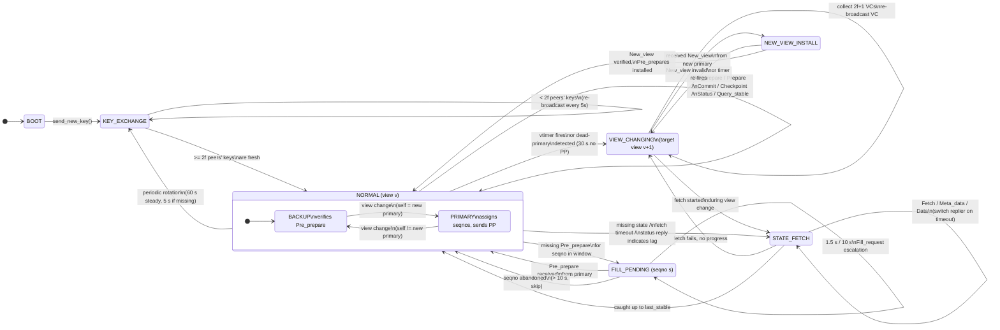
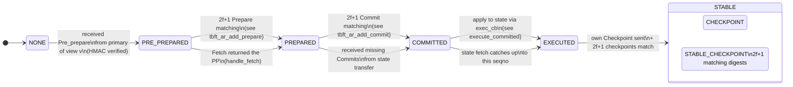

<!-- docs/06-replica-state-machine.md — generated by ultracode docs workflow. -->
<!-- Hand edits allowed: e.g., the FSM diagrams under "Finite state machines". -->

# Replica State Machine

The `tbft_replica_t` is the PBFT state machine for a single replica. It runs
as one FreeRTOS task that drives a single message-dispatch loop
(`tbft_replica_run` at `src/tbft_replica.c:277`). All cryptographic work,
sequence-number bookkeeping, view-change logic, and state-transfer recovery
execute in that loop. Timer callbacks are deliberately tiny: they only
signal an event group so heavy work never runs in the ESP timer task.

## Table of Contents

- [Overview](#overview)
- [Finite state machines](#finite-state-machines)
- [`tbft_replica_run()` main loop](#tbft_replica_run-main-loop)
- [Dispatch table](#dispatch-table)
- [Event group decoupling](#event-group-decoupling)
- [Handlers](#handlers)
  - [`handle_request`](#handle_request)
  - [`handle_pre_prepare`](#handle_pre_prepare)
  - [`handle_prepare`](#handle_prepare)
  - [`handle_commit`](#handle_commit)
  - [`handle_checkpoint`](#handle_checkpoint)
  - [`handle_view_change`](#handle_view_change)
  - [`handle_new_view`](#handle_new_view)
  - [`handle_fill_request`](#handle_fill_request)
  - [`handle_new_key`](#handle_new_key)
  - [`handle_status`](#handle_status)
  - [`handle_fetch` / `handle_meta_data` / `handle_data`](#handle_fetch--handle_meta_data--handle_data)
  - [`handle_query_stable` / `handle_reply_stable`](#handle_query_stable--handle_reply_stable)
- [Sequence number monotonicity](#sequence-number-monotonicity)
- [`send_pre_prepare`](#send_pre_prepare)
- [`send_view_change`](#send_view_change)
- [`send_new_key`](#send_new_key)
- [`execute_committed` flow](#execute_committed-flow)
- [`mark_stable` flow](#mark_stable-flow)
- [Cross-references](#cross-references)

## Overview

`tbft_replica_t` embeds three static memory regions (`ar`, `cr`, `sr`), the
view-change info struct (`vi`), the application state (`state`), request
queues (`rqueue`, `ro_rqueue`), and four FreeRTOS event bits. The
event loop polls the transport, dispatches by `hdr->tag`, then services
timer-driven event bits. Heavy work (RSA signatures, fetch state writes)
runs in the loop; the ESP timer task only sets a bit.

```
                 +-----------------------+
                 |   ESP timer task      |
                 |  vtimer_cb / stimer_cb|
                 +----------+------------+
                            | xEventGroupSetBits
                            v
+--------------------+   +----------------------------+
|  Transport task    |-->| tbft_replica_run() loop    |
|  (UDP/ESP-NOW cb)  |   |  recv -> dispatch          |
+--------------------+   |  -> handlers                |
                         |  -> send_*()                |
                         |  -> execute_committed()     |
                         +----------------------------+
```

## Finite state machines

The replica's behavior is governed by **two orthogonal state machines** that
run concurrently:

1. **Replica-level FSM** — the view, view-change, key-exchange, state-fetch,
   and fill-pending states of the replica as a whole. One node, one of these
   at a time.
2. **Per-seqno consensus FSM** — for each in-window sequence number, the
   replica tracks where it is in the Pre-prepare / Prepare / Commit / Execute
   protocol. Many seqnos are in flight simultaneously, each at its own state.

The dispatch loop in `tbft_replica_run` reads both — the replica-level FSM
gates which handlers run (e.g., a Pre-prepare is dropped if the replica is in
`STATE_FETCH`), while the per-seqno FSM lives inside the agreement region
(`tbft_agreement_region.c`) and is updated by the Prepare/Commit handlers.

### Replica-level FSM (view + recovery + key exchange)



**State storage.** The replica-level FSM is **not** a single enum — it is
the conjunction of orthogonal flags and counters on `tbft_replica_t` and
embedded structs:

| State | Set when | Cleared when | Where |
|-------|----------|--------------|-------|
| `BOOT` | task entry | first New_key sent | first iteration of `tbft_replica_run` |
| `KEY_EXCHANGE` | `send_new_key` called | 2f peers' keys marked fresh | `tbft_replica_run` KEYS-BARRIER |
| `NORMAL` | default | (always true unless in another) | implied by absence of others |
| `VIEW_CHANGING` | `tbft_replica_send_view_change` called | New_view installed | `vi.view_change_sent` (`src/tbft_view_info.h:22`) |
| `NEW_VIEW_INSTALL` | `tbft_replica_handle_new_view` starts verifying | `tbft_vi_reset` | inside `handle_new_view` |
| `STATE_FETCH` | `tbft_state_start_fetch` called | `state.in_fetch = false` | `state.in_fetch` (`src/tbft_state.h:64`) |
| `FILL_PENDING` | `r->pending_fill_seqno` set non-zero | `pending_fill_seqno = 0` | `src/tbft_replica.h:76` |

**Primary vs. Backup is a sub-state of `NORMAL`.** Computed on the fly by
`tbft_replica_is_primary` (`src/tbft_replica.h:267`):
`r->node.node_id == tbft_node_primary(&r->node, r->node.view)`. The primary
assigns the next seqno (`r->seqno`), the backup verifies that any
Pre-prepare it receives came from the matching primary.

**Self-loops are not "stay" transitions — they are message consumption.**
Each handler returns to the same state; the FSM does not advance unless an
event-driven transition fires. A NORMAL→NORMAL edge above therefore
represents "message arrived, processed, and the replica remains in NORMAL".

### Per-seqno consensus FSM

Each sequence number in the active window (`last_stable + 1` …
`last_stable + WINDOW_SIZE`) has its own per-seqno state. The state is held
inside the agreement-region slot at `(seqno - head) & mask` (see
[Static memory model](07-static-memory-model.md#agreement-region)).



**Why per-seqno is also a state machine, not just counters.** A seqno can
be `PRE_PREPARED` then re-pre-prepared under a new view (so it returns to
`PRE_PREPARED` from `PREPARED` with a different `view` field). The agreement
region stores the current `view` alongside the `seqno` and refuses messages
from old views — the FSM encodes this via the per-slot `view` field
(`tbft_agreement_region.h`).

**Quorum thresholds** (see [Certificates and quorum](09-certificates-and-quorum.md)):

| Transition | Threshold | Source |
|------------|----------:|--------|
| `NONE → PRE_PREPARED` | 1 (primary's Pre_prepare) | `handle_pre_prepare` |
| `PRE_PREPARED → PREPARED` | 2f+1 matching Prepares | `tbft_ar_add_prepare` |
| `PREPARED → COMMITTED` | 2f+1 matching Commits | `tbft_ar_add_commit` |
| `EXECUTED → STABLE` | 2f+1 matching Checkpoints | `tbft_cr_store` |
| NORMAL → VIEW_CHANGING | view-change timer (configurable) | `vtimer_cb` |

### Interaction between the two FSMs

```
         +----------------+        +-----------------+
         |  Replica FSM   |        | Per-seqno FSM   |
         |  (one per node)|        | (one per seqno) |
         +-------+--------+        +--------+--------+
                 |                          |
                 |  NORMAL                  |  many seqnos
                 +----- serves handler ---->+  in flight
                 |                          |
                 |  STATE_FETCH             |  overwrites
                 +----- handle_data ------> +  (catch-up)
                 |                          |
                 |  VIEW_CHANGING           |  aborted:
                 +----- clear slots ------> +  set to NONE
                 |                          |
                 |  NEW_VIEW_INSTALL        |  re-pre-prepared
                 +----- re-install PP  ---> +  under v+1
                 +--------------------------+
```

The replica-level FSM is the "outer" loop; the per-seqno FSM is the "inner"
loop. A replica can be in `NORMAL` while a thousand seqnos are simultaneously
in `PREPARED` awaiting their 2f+1 Commits. A replica in `STATE_FETCH` may
have no per-seqno states in flight (slots cleared) and is rebuilding them
top-down via the Merkle partition tree.

**Where transitions are checked in code.**

| Replica-FSM transition | Code site |
|------------------------|-----------|
| BOOT → KEY_EXCHANGE | `tbft_replica_run` step 2 (`src/tbft_replica.c:280`) |
| KEY_EXCHANGE → NORMAL | KEYS-BARRIER step 3 |
| NORMAL → VIEW_CHANGING | `vtimer_cb` → `xEventGroupSetBits` → `send_view_change` (step 5e1) |
| NORMAL → STATE_FETCH | `tbft_state_start_fetch` (called from `handle_status`) |
| NORMAL → FILL_PENDING | step 5g (Fill escalation, `src/tbft_replica.c:471`) |
| VIEW_CHANGING → NEW_VIEW_INSTALL | `handle_new_view` first line |
| NEW_VIEW_INSTALL → NORMAL | `tbft_vi_reset` at end of `handle_new_view` |
| STATE_FETCH → NORMAL | `state.in_fetch = false` in `handle_data` after digest match |
| FILL_PENDING → NORMAL | `pending_fill_seqno = 0` in `handle_pre_prepare` |

| Per-seqno transition | Code site |
|----------------------|-----------|
| NONE → PRE_PREPARED | `tbft_ar_add_pre_prepare` in `handle_pre_prepare` |
| PRE_PREPARED → PREPARED | `tbft_ar_add_prepare` in `handle_prepare` |
| PREPARED → COMMITTED | `tbft_ar_add_commit` in `handle_commit` |
| COMMITTED → EXECUTED | `execute_committed` step 1 in `tbft_replica_run` |
| EXECUTED → STABLE | `tbft_replica_mark_stable` after 2f+1 checkpoint cert |

## `tbft_replica_run()` main loop

Defined at `src/tbft_replica.c:277`. Pseudocode (numbered labels match
key block boundaries in source):

```
1.  vTaskDelay(node_id * 300 ms)            // stagger first New_key
2.  send_new_key()
3.  KEYS-BARRIER: wait up to 60 s for >= 2f peers' keys
4.  subscribe to ESP task watchdog (CONFIG_ESP_TASK_WDT_EN)
5.  loop while r->running:
5a.  feed watchdog
5b.  if yield_counter >= TBFT_YIELD_THRESHOLD: vTaskDelay(1 tick)
5c.  REBROADCAST New_key every 5s (if keys missing) or 60s (steady)
5d.  DEAD-PRIMARY check (backup, no view-change in progress,
     no PP for 30s after view install): send_view_change()
5e.  xEventGroupWaitBits(VTIMER | STIMER, 10ms)
5e1.   on VTIMER: send_view_change() [if threshold-1 keys fresh]
5e2.   on STIMER: broadcast Status, restart stimer
5f.  FETCH-TIMEOUT check: if state in fetch and timed out, switch replier
5g.  FILL-REQUEST: if pending_fill_seqno, run 1.5s / 10s escalation
5h.  recv() from transport (recv_buf) into src_id, n
5i.  validate n >= hdr->size, size in (0, MAX_MESSAGE_SIZE]
5j.  HMAC-key-freshness gate (drop Pre-prepare/Prepare/Commit/Checkpoint
     whose sender's keys are not fresh)
5k.  switch hdr->tag -> dispatch
6.  unsubscribe from watchdog before exiting
```

The loop body intentionally yields every 16 messages (`TBFT_YIELD_THRESHOLD`,
`src/tbft_replica.c:36`) so that the lower-priority send_task on the same
core does not starve.

## Dispatch table

The switch lives at `src/tbft_replica.c:732`:

| Tag | Constant | Handler |
|----:|----------|---------|
| 1 | `TBFT_MSG_REQUEST` | `tbft_replica_handle_request` |
| 3 | `TBFT_MSG_PRE_PREPARE` | `tbft_replica_handle_pre_prepare` |
| 4 | `TBFT_MSG_PREPARE` | `tbft_replica_handle_prepare` |
| 5 | `TBFT_MSG_COMMIT` | `tbft_replica_handle_commit` |
| 6 | `TBFT_MSG_CHECKPOINT` | `tbft_replica_handle_checkpoint` |
| 7 | `TBFT_MSG_STATUS` | `handle_status` (file-local) |
| 8 | `TBFT_MSG_VIEW_CHANGE` | `tbft_replica_handle_view_change` |
| 9 | `TBFT_MSG_NEW_VIEW` | `tbft_replica_handle_new_view` |
| 11 | `TBFT_MSG_NEW_KEY` | `tbft_replica_handle_new_key` |
| 12 | `TBFT_MSG_META_DATA` | `tbft_replica_handle_meta_data` |
| 14 | `TBFT_MSG_DATA` | `tbft_replica_handle_data` |
| 15 | `TBFT_MSG_FETCH` | `tbft_replica_handle_fetch` |
| 18 | `TBFT_MSG_FILL_REQUEST` | `tbft_replica_handle_fill_request` |
| any | unknown | `ESP_LOGD` and drop |

Tags 2 (Reply), 10 (View_change_ack), 13 (Meta_data_d), 16 (Query_stable),
17 (Reply_stable) are reserved and not currently dispatched on the
replica — Reply is sent out by `execute_committed`; the rest are
defined for protocol completeness.

## Event group decoupling

`tbft_replica_t.evt_group` is a `EventGroupHandle_t` (`src/tbft_replica.h:149`).
Two bits are defined (`src/tbft_replica.h:152-153`):

| Macro | Bit | Source | Handler side effect |
|-------|----:|--------|---------------------|
| `TBFT_EVT_VTIMER` | `1 << 0` | `vtimer_cb` (`src/tbft_replica.c:86`) | Loop calls `send_view_change()` if enough keys are fresh |
| `TBFT_EVT_STIMER` | `1 << 1` | `stimer_cb` (`src/tbft_replica.c:94`) | Loop broadcasts Status and restarts `stimer` |

`tbft_itimer_t` (`src/tbft_itimer.h:21`) wraps an `esp_timer_handle_t` in
`ESP_TIMER_TASK` dispatch mode. The internal `timer_dispatch`
(`src/tbft_itimer.c:6`) clears the running flag, then invokes the user
callback. For the replica, the user callback is a one-liner that calls
`xEventGroupSetBits`. Heavy work — view-change, RSA verify, fetch
re-pathing — never runs in the timer task.

The wait in the loop uses `pdTRUE` (clear on exit) for both bits
(`src/tbft_replica.c:399-404`). A 10ms timeout ensures the loop also
services `pending_fill_seqno`, New_key re-broadcasts, and cooperative
yields even when no timer fires.

## Handlers

### `handle_request`

`tbft_replica_handle_request` (`src/tbft_replica.c:790`). Validates
`command_size` and `cid`, verifies the trailing RSA signature against
the client's public key (`tbft_node_verify_sig`). If this replica is
not the primary, it forwards the request to the current primary
(`src/tbft_replica.c:841`) and starts the view-change timer on first
forward for the client. If this replica is the primary and a
view-change is not in progress, the request is deduplicated by
`(cid, rid)` against both queues (`rqueue` and `ro_rqueue`, the latter
selected by the `TBFT_REQUEST_RO_FLAG` bit in `hdr.extra` —
`src/tbft_replica.c:872`). On a fresh `(cid, rid)`, the request is
pushed and `tbft_replica_send_pre_prepare` is called.

### `handle_pre_prepare`

`tbft_replica_handle_pre_prepare` (`src/tbft_replica.c:901`). Drops
the PP if it is for a stale (lower) view or if the current replica is
the expected primary of that view. Verifies the PP fits in the current
window (`tbft_replica_in_window` at `src/tbft_replica.h:259`). Validates
`rset_size` and `non_det_size` to prevent integer overflow into
`auth_offset` (`src/tbft_replica.c:944`). Verifies the HMAC
authenticator over the message bytes up to `auth_offset` using the
primary's session key slot (`tbft_node_verify_auth`). On higher-view
PPs, advances `r->node.view`, re-initialises `ar`/`cr`, and re-arms
the vtimer with the configured period (`src/tbft_replica.c:984-1007`).
Recomputes the request-set digest from the embedded request and
re-verifies the embedded client's RSA signature
(`src/tbft_replica.c:1018-1076`) — this guards against a Byzantine
primary injecting forged requests. Stores the PP via
`tbft_ar_store_pp` and finally calls `tbft_replica_send_prepare`.

### `handle_prepare`

`tbft_replica_handle_prepare` (`src/tbft_replica.c:1116`). Drops
out-of-view or out-of-window prepares. If the local replica already
holds the PP for the prepare's seqno, requires `prep->digest ==
pp->digest` (`src/tbft_replica.c:1167-1174`) — Byzantine prepares
with bogus digests are rejected before they pollute certificate
value slots. If no PP is stored locally, the prepare is dropped
entirely (HIGH FIX H2 at `src/tbft_replica.c:1177-1184`). After
duplicate-sender check via `tbft_bitmap_test`, calls
`tbft_ar_add_prepare`. On reaching the prepared state, advances
`last_prepared`, broadcasts the local `Commit` (via
`tbft_replica_send_commit`), and calls
`tbft_replica_execute_committed` if already committed-local.

### `handle_commit`

`tbft_replica_handle_commit` (`src/tbft_replica.c:1233`). Same
view/window/sender validation as `handle_prepare`. MAC verified over
`sizeof(*cm)` bytes. If the PP is already stored locally, requires
`cm->digest == pp->digest`; otherwise stores the commit anyway
(allowing quorum to form before PP arrival, then re-checking at
execute time at `src/tbft_replica.c:2654-2671`). On reaching the
committed state, calls `tbft_replica_execute_committed`. If prepared
but not yet committed-local, re-broadcasts the local commit
subject to a 500ms cooldown (`src/tbft_replica.c:1324-1329`).

### `handle_checkpoint`

`tbft_replica_handle_checkpoint` (`src/tbft_replica.c:1343`). Rejects
seqnos that are not positive multiples of `TBFT_CHECKPOINT_INTERVAL`.
Ignores self-claimed checkpoints (the local one is stored in
`execute_committed` at send time). Verifies HMAC, then calls
`tbft_cr_store`. If the store returns `stable` (a `2f+1` quorum
with matching digest), calls `tbft_replica_mark_stable`.

### `handle_view_change`

`tbft_replica_handle_view_change` (`src/tbft_replica.c:1394`). Validates
sender id and RSA signature over the body (signature is appended after
`hdr.size`; the body length is `hdr.size` itself —
`src/tbft_replica.c:1406-1416`). Hands the message to
`tbft_vi_collect_vc` which records it in the special region. If
collecting did not advance the state but the VC targets a higher
view, the replica syncs its view to `vc->v`, truncates AR/CR, and
restarts the vtimer with exponential backoff capped at
`TBFT_VC_BACKOFF_MAX_MULT` (`src/tbft_replica.c:1456-1471`). If the
local replica is the new primary and a quorum is reached, it builds
and signs a `New_view` message, including per-seqno prepared
proofs for any `(seqno, digest)` that has `f+1` matching entries
across the 2f+1 received VCs (`src/tbft_replica.c:1506-1628`).

### `handle_new_view`

`tbft_replica_handle_new_view` (`src/tbft_replica.c:1684`). Rejects
`nv->v < r->node.view`. Requires `has_sig == 1` and verifies the RSA
signature over the full body. Calls `tbft_vi_verify_nv` to ensure
the proofs match the previously collected VCs. Validates
`n_prep * sizeof(tbft_vc_req_info_t)` fits the body length
(`src/tbft_replica.c:1736-1744`). Installs the new view: advances
`r->node.view`, recomputes `r->seqno` from `nv->min` and from local
`last_prepared`/`last_executed`/`n_prep` proofs, truncates AR/CR
(`src/tbft_replica.c:1755-1801`). Restarts the vtimer with
exponential backoff (`src/tbft_replica.c:1834-1848`).

### `handle_fill_request`

`tbft_replica_handle_fill_request` (`src/tbft_replica.c:3285`).
Drops requests with mismatching view, invalid id, or stale HMAC
keys. Verifies the HMAC over the request body using the requester's
in-key. Looks up the PP for the requested seqno via
`tbft_ar_load_pp`; if present, re-sends the original (signed) bytes
to the requester. The requester runs the normal
`handle_pre_prepare` path on the bytes and reaches prepared/committed
through the standard flow.

### `handle_new_key`

`tbft_replica_handle_new_key` (`src/tbft_replica.c:3183`). Drops
self-broadcasts, validates `n_keys`, and ensures the message length
covers all slots. Scans for the slot addressed to the local node.
If the slot's ciphertext is byte-identical to the last successfully
processed New_key and `keys_fresh` is true, returns immediately
(avoids ~1.6s of RSA operations per duplicate). Otherwise verifies
the RSA signature over the body, RSA-OAEP-decrypts the slot with
the local private key (`tbft_principal_decrypt_new_key`), and
installs the result as the in-key for messages from the sender via
`tbft_principal_set_in_key`.

### `handle_status`

`handle_status` (`src/tbft_replica.c:1870`, file-local). Status has
no authenticator. Drops messages with stale view. If the peer
reports a higher view, the local replica catches up to that view
(`src/tbft_replica.c:1915-1985`), truncates AR/CR, resets `seqno`,
restarts the vtimer with backoff, and triggers a state fetch if
`last_stable` lags behind. If the peer is in the same view and
`last_stable` indicates missing checkpoints, sends the local
Checkpoints for each missing one (`src/tbft_replica.c:2055-2078`).
If the peer lags behind in the same view, replays stored
Pre_prepare and Commit messages to help it catch up
(`src/tbft_replica.c:2029-2051`).

### `handle_fetch` / `handle_meta_data` / `handle_data`

`tbft_replica_handle_fetch` (`src/tbft_replica.c:2085`). Validates
`level`/`index` non-negative, then either replies with a
`Meta_data` (non-leaf level) listing child digests/versions, or
with a `Data` message carrying the leaf block (`TBFT_BLOCK_SIZE`
bytes copied from `state.mem`). Both responses are sized
to fit `out_buf` and sent only to the requester.

`tbft_replica_handle_meta_data` (`src/tbft_replica.c:2192`).
Validates `n_parts` against `TBFT_P_CHILDREN` and the message
length. Hands the response to `tbft_state_handle_meta_data`, which
walks the partition tree. If the root level showed all digests
match (or the entire fetch queue is done), the fetch is completed
and `tbft_replica_mark_stable` is called. The 4xWINDOW safety
guard was removed in v0.7.2 (commit c937fbe) so resetting replicas
can catch up in a single fetch.

`tbft_replica_handle_data` (`src/tbft_replica.c:2276`). Requires
the state machine to be in fetch. Validates the message length
covers the full block. Hands the data to
`tbft_state_handle_data` (which writes the block and updates the
Merkle digests). On completion, marks the fetched seqno stable
and advances `r->seqno`.

### `handle_query_stable` / `handle_reply_stable`

`tbft_query_stable_rep_t` (tag 16) and `tbft_reply_stable_rep_t`
(tag 17) are defined in `src/tbft_message.h:291` and
`src/tbft_message.h:302` respectively, but the current dispatch
table does not invoke a handler for them. They are part of an
unused status-recovery path kept for protocol completeness.

## Sequence number monotonicity

The replica maintains four monotonic counters:

| Field | File:line | Meaning |
|-------|-----------|---------|
| `last_stable` | `tbft_replica.h:65` | Highest checkpoint proven by 2f+1 matching digests or by state fetch |
| `last_prepared` | `tbft_replica.h:69` | Highest seqno for which a prepare certificate was completed |
| `last_executed` | `tbft_replica.h:70` | Highest seqno whose request was executed and replied to |
| `seqno` | `tbft_replica.h:62` | Primary's next-to-assign sequence number |

`tbft_replica_in_window` (`src/tbft_replica.h:259`) is the central
predicate: a `seqno` is in the active window iff
`seqno > last_stable && seqno <= last_stable + TBFT_WINDOW_SIZE`.

The primary assigns `r->seqno` and increments it after each
broadcast (`src/tbft_replica.c:2524`). A backup that accepts a PP
with a higher `seqno` advances its own `seqno` to at least
`pp->seqno + 1` (`src/tbft_replica.c:1104-1106`). View-changes
reset `r->seqno` based on `last_stable`, `last_prepared`,
`last_executed`, and any prepared proofs in the New_view
(`src/tbft_replica.c:1642-1655` and `src/tbft_replica.c:1765-1777`).
`mark_stable` advances `last_executed` to at least the stable
seqno, closing the window for completed work
(`src/tbft_replica.c:2884-2885`).

## `send_pre_prepare`

`tbft_replica_send_pre_prepare` (`src/tbft_replica.c:2308`). Only
runs on the primary. Returns immediately if a view-change is in
progress or fewer than `threshold-1` peers have fresh HMAC keys.
Picks the next request from `rqueue` (read-write) or `ro_rqueue`
(read-only, bit `TBFT_REQUEST_RO_FLAG` set in `hdr.extra`).
Dedups against `last_assigned_cid`/`last_assigned_rid` to avoid
re-assigning the same request. Stops the vtimer if the queue is
empty. Calls `comp_ndet_cb` to obtain non-deterministic choices
and bounds-checks the result against `INT16_MAX` (cast to
`int16_t` for the wire). Clears `out_buf`, builds the
`tbft_pre_prepare_rep_t`, appends the request bytes, appends the
non-det bytes, and appends the authenticator. Sets `hdr.size`
BEFORE calling `tbft_node_gen_auth` (CRITICAL FIX: the size field
is part of the MAC-covered bytes). Stores the PP locally via
`tbft_ar_store_pp` and broadcasts to all replicas. Then
immediately self-broadcasts a `Prepare` for the same digest and
`tbft_ar_add_my_prepare` (the primary's PP counts toward the
prepare threshold).

## `send_view_change`

`tbft_replica_send_view_change` (`src/tbft_replica.c:2913`).
Suppresses on persistent MAC failures (re-exchanges keys instead)
and on fresh boot (waits for Status-based view catch-up unless
stuck for >90s). Sets `vi.in_progress = true` and computes
`target = max(view + 1, vi.target_view)`. Resets `vi` for the
target. Builds the `tbft_view_change_rep_t`, embeds one
`tbft_vc_ckpt_t` (if `last_stable > 0`), and walks the prepared
seqnos in the agreement region to embed `tbft_vc_req_info_t`
entries (capped by `TBFT_WINDOW_SIZE` and the remaining
`out_buf` budget). Sets `hdr.size` and appends the RSA signature
over the body. Broadcasts to all replicas and records the local
VC via `tbft_vi_collect_vc`. Restarts the vtimer with
exponential backoff: `vtimer_period_us * (1 << shift)`, capped at
`TBFT_VC_BACKOFF_MAX_MULT` (60x).

## `send_new_key`

`tbft_replica_send_new_key` (`src/tbft_replica.c:3079`). For each
remote replica `i`, generates a fresh 32-byte HMAC session key
(only if `hmac_out_key` is currently all-zero — re-broadcasts
reuse the previously generated key to keep the ciphertext stable),
RSA-OAEP-encrypts it under `i`'s public key, and stores the
ciphertext in `last_sent_new_key_ciphertext` for byte-stable
re-broadcasts. Sets the local out-key with
`tbft_principal_set_out_key`. Builds the
`tbft_new_key_rep_t` with `n_keys` slots. Sets `hdr.size`, then
RSA-signs the body and appends the signature. Broadcasts to all
replicas. New_key messages are RSA-signed; an unsigned New_key
would let any network attacker inject arbitrary HMAC session
keys (`src/tbft_replica.c:3165-3167`).

## `execute_committed` flow

`tbft_replica_execute_committed` (`src/tbft_replica.c:2610`). Walks
seqnos from `last_executed + 1` up to `last_prepared`. For each
seqno:

1. If the slot is not committed-local, set
   `pending_fill_seqno = n` and break. The main loop will
   escalate: 500ms fill requests to the primary, 500ms commit
   re-broadcasts, then 10s abandon-or-view-change based on whether
   a prepare quorum exists.
2. If no PP is stored locally, set `pending_fill_seqno` and break.
3. Defence-in-depth: verify the commit certificate's winning
   digest matches the PP's digest (`src/tbft_replica.c:2654-2671`).
4. Call `r->exec_cb` with the embedded request bytes, the
   non-deterministic buffer, the client id, and the read-only flag.
5. On success, build a `tbft_reply_rep_t` in `out_buf`, RSA-sign
   it, and call `recv_reply_cb` followed by `tbft_node_send`
   to the client. Update `last_executed_rid[cid]`.
6. If the seqno is a multiple of `TBFT_CHECKPOINT_INTERVAL`,
   checkpoint the state, build a `tbft_checkpoint_rep_t` with
   HMAC, store it locally via `tbft_cr_store`, and broadcast.
   If the local store made the checkpoint stable, call
   `tbft_replica_mark_stable`.

After the loop, re-arm the vtimer if pending requests remain.

## `mark_stable` flow

`tbft_replica_mark_stable` (`src/tbft_replica.c:2821`). Returns
immediately if `seqno <= last_stable`. Looks up the winning
checkpoint digest via `tbft_cr_winning_digest`; if the winning
digest does not match the local state digest and no fetch is
already in progress, starts a state fetch (rate-limited to 500ms
between starts). Otherwise calls `tbft_state_mark_stable` with
the seqno, sets `last_stable = seqno`, sets `quorum_last_stable`
only when a genuine checkpoint quorum confirmed it (so the
fetch-only path does not poison Status reports), and advances
`last_prepared`/`last_executed` to at least `seqno`. Clears any
pending fill at or below the stable seqno. Truncates AR
(`tbft_ar_truncate`) and CR (`tbft_cr_truncate`) so the static
memory can be reused. Re-arms the vtimer at half the current
backoff period.

## Cross-references

- `docs/08-message-protocol.md` — message tags, struct layout, and
  wire formats referenced by every handler.
- `docs/01-architecture.md` — overall system layering, region
  ownership, transport selection.
- `docs/04-crypto.md` — RSA-OAEP for New_key, HMAC-SHA256 for
  consensus messages, signature verification on the slow path.
- `src/tbft_replica.c` — handler source.
- `src/tbft_replica.h` — struct fields and event-bit macros.
- `src/tbft_message.h` — message struct definitions.
- `src/tbft_itimer.c` — `tbft_itimer_t` semantics.

Last verified against commit c937fbe (v0.7.2-state-transfer-fix).
