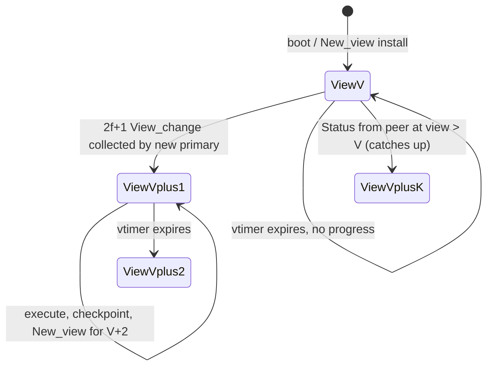
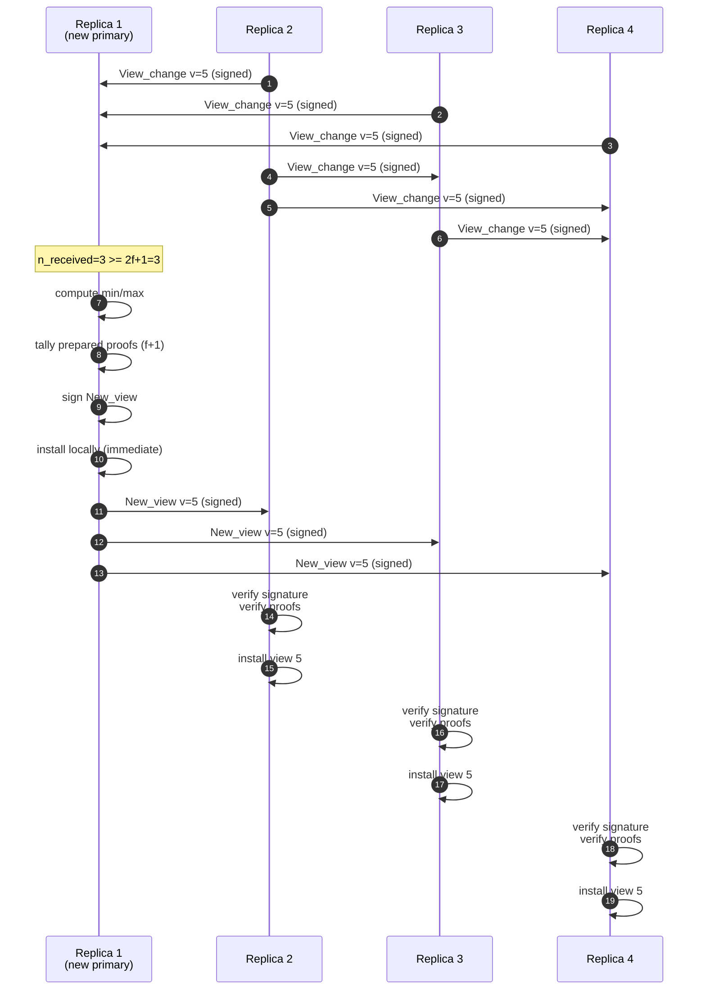
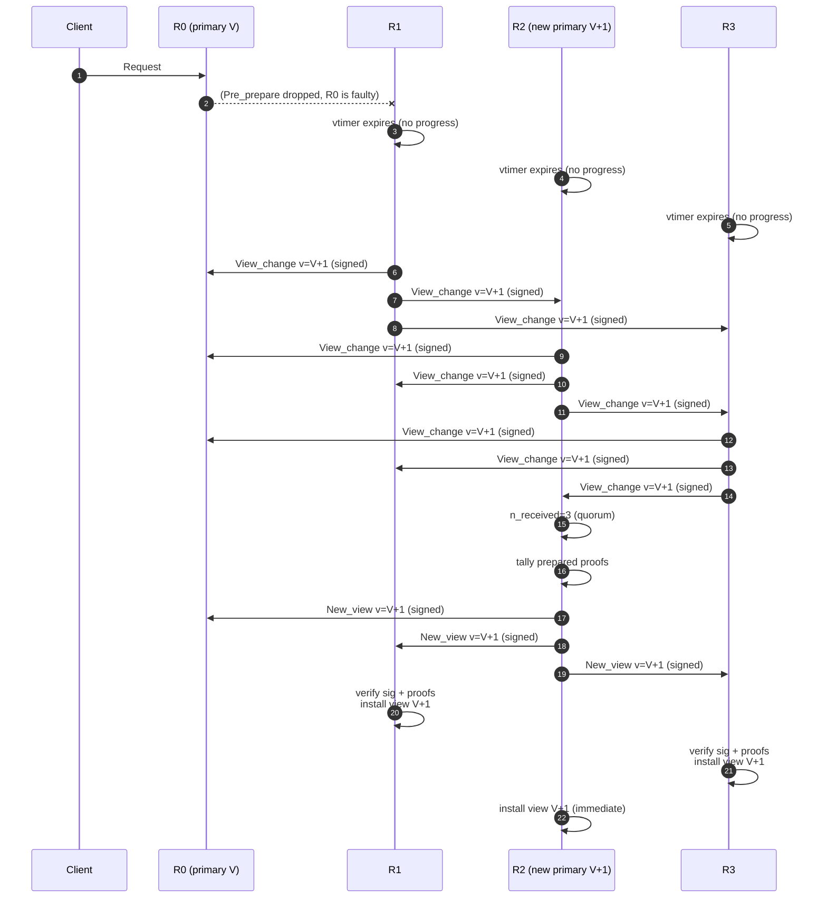

<!-- docs/10-view-changes.md — generated by ultracode docs workflow. Do not edit by hand. -->

# View Changes

TinyBFT inherits the PBFT view-change protocol. When a replica suspects
the primary of being faulty (vtimer expiry, repeated MAC failures, or
Status reports a higher view), it broadcasts a `View_change` message
proposing a new view number `v+1`. The new primary for that view
collects `2f+1` matching `View_change` messages, computes the seqno
range it must re-propose, and broadcasts a `New_view` message that all
replicas install atomically.

This document covers the structs, the send and handle paths, the
quorum math, the RSA signing rules, and the local state mutations
that follow a New_view install.

## Contents

- [Overview](#overview)
- [When a view-change fires](#when-a-view-change-fires)
- [`tbft_view_info_t` struct](#tbft_view_info_t-struct)
- [Primary assignment: `v mod n`](#primary-assignment-v-mod-n)
- [`send_view_change` flow](#send_view_change-flow)
- [View_change message construction](#view_change-message-construction)
- [View_change handling](#view_change-handling)
- [View_change_ack handling](#view_change_ack-handling)
- [New_view construction](#new_view-construction)
- [New_view installation](#new_view-installation)
- [RSA signatures on view-change messages](#rsa-signatures-on-view-change-messages)
- [Suppression guards](#suppression-guards)
- [Cross-references](#cross-references)

## Overview

A view change replaces the current primary (`p = v mod n`) with
`p' = (v+1) mod n` after a fault is suspected. All replicas must
arrive at the same view number for the cluster to make progress; the
protocol uses `2f+1` `View_change` messages as the synchronisation
barrier.



The protocol state lives in `tbft_view_info_t`
(`src/tbft_view_info.h:17-35`) and the message-flow logic in
`tbft_replica.c` (`tbft_replica_handle_view_change`,
`tbft_replica_handle_new_view`, `tbft_replica_send_view_change`).

## When a view-change fires

Three code paths in `tbft_replica.c` invoke
`tbft_replica_send_view_change(r)`:

| Trigger | Location | Notes |
|---|---|---|
| `vtimer` expiry while requests are pending | `tbft_replica.c:395` and `:419` | Backoff doubles period each failure. |
| Status from peer reporting a higher view (and we have pending requests, no quorum yet) | `tbft_replica.c:625` | Catches up after noticing we have fallen behind. |
| Inside `tbft_replica_handle_view_change` when the local view is < the received `vc->v` and we cannot collect (no quorum yet at the new view) | `tbft_replica.c:1477-1499` | C1-fix path: previously the quorum check was inside the `!collect_vc` branch, which could skip New_view construction after a target-view advance. |

The exponential-backoff machinery in
`TBFT_VC_BACKOFF_MAX_MULT` is bounded by `shift ∈ [1, 6]`, so the
timer period grows as `vtimer_period_us × 2^shift` capped at
`TBFT_VC_BACKOFF_MAX_MULT × vtimer_period_us`.

## `tbft_view_info_t` struct

Defined at `tbft_view_info.h:17-35`:

```c
typedef struct {
    tbft_view_t  target_view;                                 // view we are installing
    int          num_replicas;
    int          threshold;                                   // 2f+1
    bool         in_progress;                                 // suppresses primary PP broadcasts
    tbft_special_region_t *sr;                               // back-pointer
    bool         received[TBFT_MAX_NUM_REPLICAS];
    tbft_seqno_t last_stable[TBFT_MAX_NUM_REPLICAS];          // per-replica ls from each VC
    int          n_received;                                  // count of received VCs
} tbft_view_info_t;
```

### Functions

| Function | Location | Purpose |
|---|---|---|
| `tbft_vi_init` | `tbft_view_info.c:7-14` | Set `num_replicas`, `threshold`, store the special-region back-pointer, zero the rest. |
| `tbft_vi_reset` | `tbft_view_info.h:47`, impl `tbft_view_info.c:16-25` | Zero `n_received`, `received[]`, `last_stable[]`; clear VC slots in the special region. Used at the start of every view-change round. |
| `tbft_vi_collect_vc` | `tbft_view_info.c:27-63` | Validate the message, store it in the special region via `tbft_sr_store_vc`, set `received[sender]`, copy `rep->ls` into `last_stable[sender]`. **Auto-advances** `target_view` to a higher `rep->v`. |
| `tbft_vi_has_quorum` | `tbft_view_info.c:65-68` | Returns `n_received >= threshold`. |
| `tbft_vi_compute_min_max` | `tbft_view_info.c:70-99` | `min = max(rep->ls)`, `max = min(rep->ls + WINDOW_SIZE)`. |
| `tbft_vi_verify_nv` | `tbft_view_info.c:101-191` | Bounds + per-proof `f+1` attestation check; rejects under-quorum NVs. |
| `tbft_vi_collect_vc_ack` | `tbft_view_info.c:193-201` | Stores an ack in the special region; no quorum is computed from acks (the VC itself is the vote). |

`tbft_vi_collect_vc` auto-advances `target_view` if it sees a VC
proposing a higher view (line 36-46). The reset is performed
*before* the duplicate check so the same message that triggers the
reset is then re-stored. This is the only mechanism by which a
local replica catches up to a higher view mid-round.

## Primary assignment: `v mod n`

The primary for view `v` is replica `v mod n`. The convention is
implemented in `tbft_node_primary` (referenced from
`tbft_replica.c:1435`, `:1506`, `:1714`) and is set in:

- `tbft_replica_handle_view_change` (line 1435, 1483, 1506, 1635) —
  when the replica itself advances its view.
- `tbft_replica_handle_new_view` (line 1714, 1758) — when an
  external New_view is installed.
- `handle_status` (line 1919) — on view catch-up from a Status
  message.

`tbft_node_primary` is the *only* authority on "who is the primary";
replicas do not re-derive this from raw view numbers anywhere in the
codebase.

## `send_view_change` flow

The full function is at `tbft_replica.c:2913-3073`. The flow is:

1. **Suppression: persistent MAC failures** (line 2919-2926). If
   `consecutive_mac_failures >= 20`, the session keys are assumed
   stale — the function sends a `New_key` instead, clears the
   counter, and reschedules the vtimer at `4×` period.
2. **Suppression: fresh boot** (line 2934-2954). If
   `last_stable == 0 && last_executed == 0 && view < 3`, the replica
   is presumed to be part of a mass-reboot. The Status exchange
   should bring the cluster into alignment, so the vtimer is
   rescheduled at `8×` period for up to 90 s of "stuck" time. After
   90 s, the suppression is dropped and a VC is sent anyway.
3. **Compute target view** (line 2956-2964). `target = view + 1`
   unless the local view-info is already targeting a higher view.
   The view-info is reset to the new target and `in_progress` is
   set so the primary will not broadcast Pre_prepares during the
   window.
4. **Build the message** (line 2966-3030) — see
   [View_change message construction](#view_change-message-construction).
5. **Sign with RSA** (line 3041-3051). The signature is appended
   *after* `hdr.size`, which holds the body length (not including
   the signature). If signing fails, the function returns without
   sending — there is no unsigned fallback.
6. **Send via `tbft_node_send`** (line 3053). The recipient set is
   `TBFT_ALL_REPLICAS`.
7. **Self-collect** (line 3057-3059). The message is added to the
   local view-info via `tbft_vi_collect_vc` if we have not already
   counted our own VC.
8. **Backoff** (line 3061-3072). The vtimer is rescheduled at
   `vtimer_period_us × 2^shift`, capped at `TBFT_VC_BACKOFF_MAX_MULT ×
   vtimer_period_us`. The shift equals the view gap, bounded to
   `[1, 6]`.

## View_change message construction

The on-the-wire layout is documented at `tbft_message.h:150-177`:

```text
[hdr][tbft_view_change_rep_t][ckpts array][req_info array][RSA signature]
```

The rep fields (`tbft_view_change_rep_t`, `tbft_message.h:169-177`):

| Field | Type | Source |
|---|---|---|
| `hdr` | `tbft_msg_hdr_t` | tag = `TBFT_MSG_VIEW_CHANGE` |
| `v` | `tbft_view_t` | target view number |
| `ls` | `tbft_seqno_t` | sender's last stable seqno (or `last_executed - WINDOW_SIZE` if execution has outrun the last stable checkpoint) |
| `n_ckpts` | `int32_t` | number of `tbft_vc_ckpt_t` entries that follow |
| `n_reqs` | `int32_t` | number of `tbft_vc_req_info_t` entries |
| `id` | `int32_t` | sender's replica id |

The two embedded arrays are written at `tbft_replica.c:2992-3030`:

- **Checkpoints**: when `last_stable > 0`, a single
  `tbft_vc_ckpt_t { seqno = last_stable, digest = state root }` is
  appended.
- **Prepared proofs**: for every seqno `s ∈ [last_stable+1,
  last_prepared]` such that `tbft_ar_prepared(&ar, s)` is true, a
  `tbft_vc_req_info_t { seqno = s, last_view = view, digest = pp.digest }`
  is appended. The loop is bounded by `TBFT_WINDOW_SIZE` and by the
  remaining space in `out_buf`.

The `ls` self-rescue branch (line 2985-2987) handles the case where
execution has outrun the last stable checkpoint by more than one
window. Without it, the new primary's window would freeze at an old
stable seqno and no proposals could be made:

```c
if (r->last_executed > vc->ls + TBFT_WINDOW_SIZE) {
    vc->ls = r->last_executed - TBFT_WINDOW_SIZE;
}
```

## View_change handling

The receive path is `tbft_replica_handle_view_change`
(`tbft_replica.c:1394-1678`). Sequence:

1. **Length + sender validation** (line 1396-1401). Reject if `len <
   sizeof(tbft_view_change_rep_t)` or if the embedded sender id is
   outside `[0, num_replicas)`.
2. **RSA signature verification** (line 1403-1420). Body length
   comes from `hdr.size`; signature sits at `msg + body_size`. A
   failed verification drops the message and logs a warning.
3. **Local view advance** (line 1422-1474). If `vc->v > local_view`
   and the message is not collectable (no slot free or wrong target),
   the local view is updated: `cur_primary` is recomputed,
   `seqno`/`last_prepared`/`last_executed` are kept contiguous, the
   checkpoint region is truncated, the agreement region is
   reinitialised, and the vtimer is rescheduled with backoff if
   requests are pending. There is no catch-up VC cascade
   (line 1456-1459 explicitly removes the old behaviour that would
   have proposed `view+1`).
4. **Collect into `tbft_view_info_t`** (line 1424). On success the
   function continues; on failure it falls through to the
   view-catch-up path.
5. **Higher-view re-collect** (line 1477-1499). If the message's
   view is greater than the current `target_view`, the view-info
   is reset to the new view and the message is re-collected.
6. **Primary-side New_view construction** (line 1506-1677). If the
   local node is the new primary and `tbft_vi_has_quorum` is true,
   the function builds and broadcasts a `New_view`. See
   [New_view construction](#new_view-construction).

## View_change_ack handling

The codebase stores view-change acks in the special region
(`tbft_vi_collect_vc_ack`, `tbft_view_info.c:193-201`) but does
**not** construct a separate acks-based certificate before computing
a New_view. The ack message format is `tbft_vc_ack_rep_t`
(`tbft_message.h:198-203`):

```c
typedef struct __attribute__((packed)) {
    tbft_msg_hdr_t  hdr;
    tbft_view_t     v;
    int32_t         id;       // ack sender id
    int32_t         vc_id;    // original VC sender id
} tbft_vc_ack_rep_t;
```

Acks are kept in storage and may be retransmitted on demand, but the
quorum check for New_view construction is based on the 2f+1
View_change messages themselves (`vi.n_received >= vi.threshold`),
not on a separate acks-cert.

## New_view construction

When the local node is the new primary and 2f+1 VCs have been
collected, `tbft_replica_handle_view_change` switches into
construction mode at `tbft_replica.c:1506-1677`. Steps:

1. **Compute min/max** (line 1509-1510). Calls
   `tbft_vi_compute_min_max` → `min = max(ls)`, `max =
   min(ls + WINDOW_SIZE)`.
2. **Tally prepared proofs across VCs** (line 1516-1576). For every
   seqno/digest pair observed in a VC's `req_info` array (within
   the `[min, max]` range), increment a per-pair counter. The
   counter array is statically allocated at module scope as
   `counts[TBFT_WINDOW_SIZE]`. Each entry is bounded by the
   `n_ckpts`/`n_reqs` validation at line 1543-1548 (uses
   `int64_t` arithmetic to prevent signed-overflow before the
   `< 0` guard).
3. **Filter by `f+1` threshold** (line 1592-1608). Each pair with
   `count >= f+1` is appended to the New_view body as a
   `tbft_vc_req_info_t { seqno, last_view = view - 1, digest }`.
   The loop is bounded by `body_end = out_buf + sizeof(out_buf) -
   sizeof(sig)`.
4. **Header** (line 1579-1609). The `tbft_new_view_rep_t` is filled
   with `tag = TBFT_MSG_NEW_VIEW`, `v = target_view`, `min`,
   `max`, `has_sig = 1`, and the actual proof count.
5. **Sign and send** (line 1611-1626). `hdr.size = body_size` (proof
   count + fixed header, 8-byte aligned via `tbft_msg_align`). The
   RSA signature is appended. Send via `tbft_node_send` with
   `TBFT_ALL_REPLICAS`.
6. **Local install** (line 1630-1677). The new view is also
   installed immediately on the primary so it can start proposing
   Pre_prepares before loopback. See
   [New_view installation](#new_view-installation) for the field
   updates.



The full sequence diagram in context (view change with concurrent
request in flight):



## New_view installation

`tbft_replica_handle_new_view` (`tbft_replica.c:1684-1853`) is the
single install path. Steps:

1. **Length + view sanity** (line 1686-1690). Reject `len <
   sizeof(tbft_new_view_rep_t)` or `nv->v < local view`.
2. **Signature gate** (line 1695-1699). Reject when
   `nv->has_sig == 0` *before* any body processing.
3. **Body length** (line 1701-1711). `body_size` from
   `hdr.size`; signature is at `msg + body_size`.
4. **Signature verification** (line 1712-1720). Verified against
   `new_primary = tbft_node_primary(node, nv->v)` so a Byzantine
   replica at a different id cannot sign on behalf of the new
   primary.
5. **Content verification** (line 1722-1729). Calls
   `tbft_vi_verify_nv` (see
   [Quorum checks](#quorum-checks)).
6. **Proof length sanity** (line 1731-1750). `n_prep` must be in
   `[0, TBFT_WINDOW_SIZE]`; `body_size` must be at least
   `header_size + n_prep * sizeof(tbft_vc_req_info_t)`.
7. **View update** (line 1752-1759). `view = nv->v`, timestamps
   `view_installed_us`, `view_start_executed = last_executed`,
   `cur_primary = primary(view)`, forwarded-request buffer reset.
8. **Monotonic seqno** (line 1765-1778). `seqno = max(nv->min,
   last_prepared, last_executed, max_proof_seqno) + 1`. This keeps
   the window strictly inside `[last_stable+1, last_stable+
   WINDOW_SIZE]` — `nv->max + 1` would land outside.
9. **Local marker advance** (line 1780-1786). `last_stable`,
   `last_executed`, `last_prepared` are advanced to at least
   `nv->min`. `tbft_state_mark_stable` is called with `nv->min`.
10. **Region reset** (line 1787-1791). Checkpoint region is
    truncated; agreement region is reinitialised with the same
    thresholds and `head = nv->min + 1`. Prepared seqnos from
    the old view will be re-fetched via the fill mechanism.
11. **Head advance if `seqno` overshoots** (line 1796-1800). If
    `seqno >= head + WINDOW_SIZE` (e.g. `nv->min = 0` but
    `n_prep > 0`), call `tbft_ar_truncate(ar, seqno)`. The C1
    fix in v0.7.2 ensures the *head* advances by the full
    jump (not capped) — see `tbft_agreement_region.c:118-146`.
12. **Prepared proofs log** (line 1811-1827). For observability,
    the install logs each prepared proof with seqno, first digest
    byte, and the view in which it was prepared. The actual fill
    happens later when execution reaches the gap.
13. **vtimer reset** (line 1829-1849). Stop the vtimer, reset
    `tbft_vi` to `nv->v + 1`, clear `in_progress`, then
    reschedule with backoff proportional to the view gap
    (`1LL << shift`).

### Quorum checks

`tbft_vi_verify_nv` (`tbft_view_info.c:101-191`) enforces four
properties of a candidate New_view:

| Check | Location | Failure mode |
|---|---|---|
| `len >= sizeof(tbft_new_view_rep_t)` | line 104 | Reject short messages. |
| `nv->v == vi.target_view` | line 105 | Reject mismatched view. |
| `nv->min <= nv->max` | line 106 | Reject inverted range. |
| `vi.n_received >= vi.threshold` | line 112-116 | Reject premature NVs. |
| `nv->min >= expected_min` | line 121-125 | Reject lax `min`. |
| `nv->max <= expected_max` | line 126-130 | Reject lax `max`. |
| `body_size >= header + n_prep × sizeof(tbft_vc_req_info_t)` | line 138-143 | Reject malformed body. |
| Per-proof `f+1` attestations | line 145-189 | Reject unproven (seqno, digest) pairs. |

The "premature NV" check is critical — without it,
`tbft_vi_compute_min_max` would produce lax bounds (the `first`
flag is never set so `min_val = 0`, `max_val = TBFT_WINDOW_SIZE`),
allowing a buggy or premature NV to pass verification and corrupt
the state machine (`tbft_view_info.c:108-115`).

Per-proof verification walks every collected VC and counts how
many contain a matching `(seqno, digest)` entry. The required
count is `(threshold / 2) + 1 = f + 1` (line 182-187). VC parsing
is bounded by `vc->n_ckpts`/`vc->n_reqs` validation and by a
`body_end = vc_buf + vc_len - sizeof(tbft_sig_t)` guard
(line 156-170).

## RSA signatures on view-change messages

Two messages in the view-change protocol require RSA signatures:

| Message | Signature location | Verified by |
|---|---|---|
| `View_change` | After the body, length `TBFT_SIG_SIZE` (256 bytes), body length in `hdr.size` | `tbft_replica_handle_view_change` (line 1416) |
| `New_view` | Same convention, signature at `msg + body_size` | `tbft_replica_handle_new_view` (line 1715) |

The wire convention is documented at `tbft_message.h:151-154`:

```
Wire: [hdr][View_change_rep][ckpts array][prepared bitmap][req_info array]
      [RSA signature]
```

The signature is **not** included in `hdr.size`. The receiver
reconstructs the body length from `hdr.size` and reads the signature
at `msg + body_size`. This separation lets the sender compute the
signature after `hdr.size` is known and lets the receiver bound the
body before any signature work.

The signature failure modes are:

| Failure | Handling | Location |
|---|---|---|
| View_change: signature missing (len < body + sig) | drop, log warn | `tbft_replica.c:1411-1414` |
| View_change: signature invalid | drop, log warn | `tbft_replica.c:1416-1420` |
| View_change: signing failed before send | abort, do not send | `tbft_replica.c:3047-3051` |
| New_view: `has_sig == 0` | reject (no body processing) | `tbft_replica.c:1695-1699` |
| New_view: signature missing | drop, log warn | `tbft_replica.c:1707-1711` |
| New_view: signature invalid | drop, log warn | `tbft_replica.c:1715-1720` |
| New_view: signing failed before send | abort, do not send | `tbft_replica.c:1618-1622` |

The `has_sig` field is mandatory on the wire so a buggy sender that
forgot to sign cannot trigger proof-iteration work in the receiver.

## Suppression guards

Two guards in `tbft_replica_send_view_change` prevent the cluster
from splintering into divergent views:

1. **MAC-failure suppression** (`tbft_replica.c:2919-2926`).
   `consecutive_mac_failures >= 20` ⇒ send `New_key` instead and
   back off. Stale session keys make every view-change verify
   fail, so the right move is to re-exchange keys first.
2. **Fresh-boot suppression** (`tbft_replica.c:2934-2954`).
   `last_stable == 0 && last_executed == 0 && view < 3` ⇒ back
   off the vtimer for up to 90 s. Status-based view catch-up is
   given priority so the cluster converges on a single view
   number rather than each replica independently proposing
   `view+1` and ending up at `view+K`.

Both guards log at WARN level so the operator can see why a
view-change was deferred.

## Cross-references

- [04-protocol-messages.md](04-protocol-messages.md) — message tag
  table and rep struct definitions (`tbft_view_change_rep_t`,
  `tbft_new_view_rep_t`, `tbft_vc_ack_rep_t`).
- [05-state-machine.md](05-state-machine.md) — how the view-change
  result feeds the agreement state machine.
- [06-checkpoints-and-state-transfer.md](06-checkpoints-and-state-transfer.md)
  — `last_stable` semantics and the checkpoint-region re-init that
  happens on every New_view install.
- [09-certificates-and-quorum.md](09-certificates-and-quorum.md) —
  the `tbft_view_info_t` collect/verify logic mirrors the
  certificate pattern.
- [15-security-model.md](15-security-model.md) — RSA-2048 keys,
  `mbedtls_pk_sign`/`mbedtls_pk_verify` on the slow path, replay
  protection.
- [16-memory-sizing.md](16-memory-sizing.md) — `TBFT_WINDOW_SIZE`
  drives both the per-VC `req_info` array bound and the
  `counts[]` static allocation in the New_view builder.

*Last verified against: `c937fbe` — v0.7.2-state-transfer-fix: remove 4×WINDOW limit on state fetch.*
