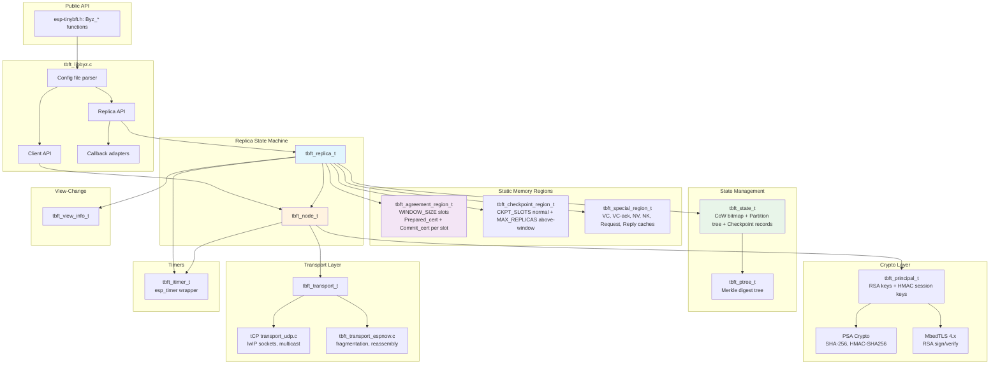
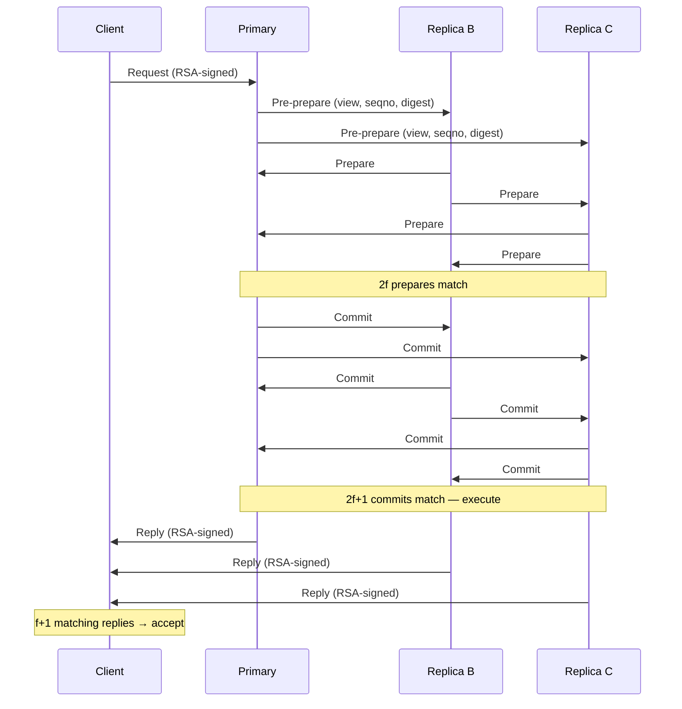
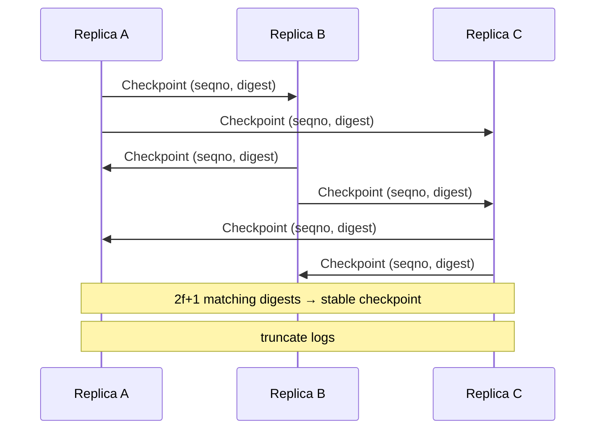
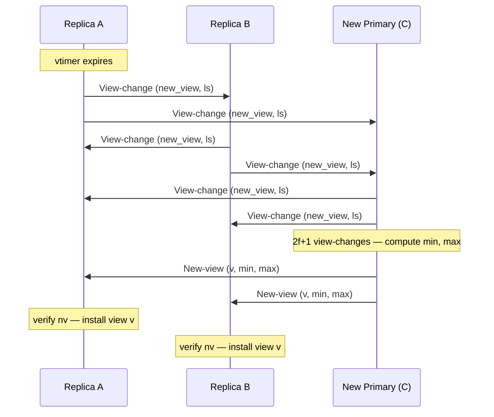

# esp-tinybft Architecture

TinyBFT is a pure-C implementation of PBFT (Practical Byzantine Fault Tolerance) optimised for embedded systems running ESP-IDF. It uses static memory allocation throughout -- no `malloc` in the hot path -- and supports two transport backends: UDP over lwIP sockets and ESP-NOW with automatic fragmentation/reassembly. Cryptography uses PSA Crypto for SHA-256/HMAC (fast path) and MbedTLS 4.x for RSA-2048 signatures (slow path).

## 1. Overview

### BFT Model

TinyBFT implements the PBFT protocol for a cluster of `n = 3f + 1` replicas, tolerating up to `f` Byzantine (arbitrarily faulty) nodes. The default configuration is `f = 1`, giving `n = 4` replicas.

### Protocol Phases

| Phase | Messages | Quorum | Purpose |
|---|---|---|---|
| Normal-case ordering | Request, Pre-prepare, Prepare, Commit, Reply | 2f prepares, 2f+1 commits | Totally order client requests |
| Checkpoint | Checkpoint | 2f+1 matching | Garbage-collect logs, prove execution |
| View-change | View-change, New-view | 2f+1 view-changes | Replace faulty primary |
| State transfer | Fetch, Meta-data, Data | 1 replier | Bring lagging replica up to date |

### Fault Tolerance Matrix

| Config value | f (faulty) | n (replicas) | Quorum (2f+1) |
|---|---|---|---|
| `TBFT_MAX_NUM_REPLICAS = 4` | 1 | 4 | 3 |
| `TBFT_MAX_NUM_REPLICAS = 7` | 2 | 7 | 5 |
| `TBFT_MAX_NUM_REPLICAS = 10` | 3 | 10 | 7 |

## 2. Architecture Diagram



## 3. Transport Layer

### Backend Selection

Controlled by Kconfig `TBFT_TRANSPORT_TYPE`:

| Choice | Macro | Source File |
|---|---|---|
| UDP over lwIP | `CONFIG_TBFT_TRANSPORT_UDP` | `src/tbft_transport_udp.c` |
| ESP-NOW | `CONFIG_TBFT_TRANSPORT_ESPNOW` | `src/tbft_transport_espnow.c` |

### Public API (src/tbft_transport.h)

```c
typedef enum {
    TBFT_TRANSPORT_UDP = 0,
    TBFT_TRANSPORT_ESPNOW = 1,
} tbft_transport_type_t;

int tbft_transport_create(tbft_transport_t **out, tbft_transport_type_t type,
                          int num_nodes, const char *mcast_ip, uint16_t port);
void tbft_transport_free(tbft_transport_t *t);
void tbft_transport_set_peer(tbft_transport_t *t, tbft_node_id_t node_id,
                             const tbft_addr_t *addr);
int tbft_transport_send(tbft_transport_t *t, const void *buf, size_t len,
                        tbft_node_id_t dest);
int tbft_transport_recv(tbft_transport_t *t, void *buf, size_t buf_len,
                        tbft_node_id_t *src_id);
```

### UDP Backend (`tbft_udp_t` internal struct)

```c
typedef struct {
    int sock;
    struct sockaddr_in mcast_addr;
    bool use_multicast;
    tbft_addr_t  peers[TBFT_MAX_NUM_REPLICAS + TBFT_MAX_NUM_CLIENTS];
    bool         peer_valid[TBFT_MAX_NUM_REPLICAS + TBFT_MAX_NUM_CLIENTS];
    int          num_nodes;
} tbft_udp_t;
```

- Opens a non-blocking UDP socket with `SO_REUSEADDR`
- If `mcast_ip` is provided and `TBFT_DISABLE_MULTICAST` is not set, joins the multicast group via `IP_ADD_MEMBERSHIP`
- Broadcast (`dest == TBFT_ALL_REPLICAS`) sends via multicast or iterates unicast to each peer
- `recvfrom` is non-blocking; returns 0 when no data available
- Sender identification by matching `IP:port` against peer table

### ESP-NOW Backend (`tbft_espnow_t` internal struct)

```c
typedef struct {
    uint16_t msg_id;
    uint8_t  frag_idx;
    uint8_t  frag_total;
} frag_hdr_t;  // 4 bytes, packed

typedef struct {
    uint8_t   buf[TBFT_MAX_MESSAGE_SIZE];
    int       buf_len;
    uint16_t  msg_id;
    uint8_t   frag_total;
    uint8_t   frag_received;
    uint32_t  frag_mask;       // bitmask, supports up to 32 fragments
    uint8_t   src_mac[6];
    bool      valid;
    TickType_t last_tick;
} reasm_slot_t;

typedef struct tbft_espnow {
    tbft_addr_t  peers[TBFT_MAX_NUM_REPLICAS + TBFT_MAX_NUM_CLIENTS];
    bool         peer_valid[TBFT_MAX_NUM_REPLICAS + TBFT_MAX_NUM_CLIENTS];
    int          num_nodes;
    QueueHandle_t msg_queue;            // fully reassembled messages
    reasm_slot_t  reasm[REASM_MAX_SLOTS]; // 4 concurrent reassembly slots
    uint16_t next_msg_id;
    SemaphoreHandle_t lock;
    volatile bool send_done;
    volatile bool send_ok;
} tbft_espnow_t;
```

Key properties:
- ESP-NOW v2.0 max data length: 1470 bytes (`ESP_NOW_MAX_DATA_LEN_V2`)
- Fragment header: 4 bytes (`msg_id`, `frag_idx`, `frag_total`)
- Max payload per fragment: 1466 bytes
- Max fragments for a `TBFT_MAX_MESSAGE_SIZE` (8192) message: 6
- Reassembly uses a FreeRTOS `QueueHandle_t` with entries of size `6 + 4 + TBFT_MAX_MESSAGE_SIZE`
- Reassembly timeout: 5000 ms
- Send waits synchronously for the ESP-NOW send callback (up to 100 retries, 1 ms each)
- Peers registered via `esp_now_add_peer` with `WIFI_IF_STA`

### Network Address Type

```c
typedef struct { uint8_t bytes[6]; } tbft_mac_addr_t;

typedef struct {
    union {
        struct { uint32_t ip; uint16_t port; } udp;  // network byte order
        tbft_mac_addr_t mac;
    } u;
} tbft_addr_t;
```

## 4. Crypto Layer

### PSA Migration

All hashing and HMAC operations use **PSA Crypto**, not MbedTLS direct APIs, because MbedTLS 4.x made functions like `mbedtls_sha256()` and HMAC private.

| Operation | PSA API | Purpose |
|---|---|---|
| SHA-256 digest | `psa_hash_compute(PSA_ALG_SHA_256, ...)` | Message digests, state block digests |
| HMAC-SHA256 | `psa_mac_compute(key_id, PSA_ALG_HMAC(PSA_ALG_SHA_256), ...)` | Authenticator slots (hot path) |
| RSA encrypt | `psa_asymmetric_encrypt(key_id, PSA_ALG_RSA_PKCS1V15_CRYPT, ...)` | Session key exchange |
| RSA decrypt | `psa_asymmetric_decrypt(key_id, PSA_ALG_RSA_PKCS1V15_CRYPT, ...)` | Session key reception |

### RSA via MbedTLS 4.x

RSA signing and verifying use MbedTLS `pk_sign` / `pk_verify` with `MBEDTLS_MD_SHA256`. MbedTLS 4.x removed `f_rng`/`p_rng` parameters from these functions.

For RSA encryption/decryption (session key exchange), the MbedTLS `mbedtls_pk_context` is imported into a transient PSA key via `mbedtls_pk_import_into_psa`, then `psa_asymmetric_encrypt` / `psa_asymmetric_decrypt` are used with PKCS#1 v1.5 padding.

### Key Types

```c
typedef struct { uint8_t bytes[32]; } tbft_digest_t;  /* SHA-256 */
typedef struct { uint8_t bytes[32]; } tbft_mac_t;      /* HMAC-SHA256 */
typedef struct { uint8_t bytes[32]; } tbft_hmac_key_t; /* Session key */
typedef struct { uint8_t bytes[256]; } tbft_sig_t;     /* RSA-2048 signature */
```

### Authenticator (tbft_auth_t)

```c
typedef struct {
    tbft_mac_t slots[TBFT_MAX_NUM_REPLICAS - 1];
} tbft_auth_t;
```

Each slot holds an HMAC-SHA256 computed with the symmetric key shared with one remote replica. Slot `i` corresponds to replica index `i` with the local node's own slot skipped. Total size: `32 * (TBFT_MAX_NUM_REPLICAS - 1)` bytes. For `f=1` (4 replicas): 96 bytes.

### Digest Comparison

`tbft_digest_equal()` uses constant-time comparison (XOR accumulation) to avoid timing side-channels.

## 5. Node (tbft_node_t)

### Struct Layout (src/tbft_node.h)

```c
struct tbft_node {
    tbft_node_id_t  node_id;
    int             max_faulty;     /* f */
    int             num_replicas;   /* n = 3f+1 */
    int             threshold;      /* 2f+1 */
    tbft_view_t     view;
    int             cur_primary;    /* view % num_replicas */

    tbft_principal_t  *principals[TBFT_MAX_NUM_REPLICAS + TBFT_MAX_NUM_CLIENTS];
    int                num_principals;
    tbft_principal_t  *local_principal;   /* shortcut */

    tbft_transport_t   *transport;
    uint8_t   recv_buf[TBFT_MAX_MESSAGE_SIZE];

    tbft_itimer_t  atimer;
    int64_t        auth_timeout_us;
    uint64_t       rid_counter;
};
```

### All Functions

| Function | Signature | Description |
|---|---|---|
| `tbft_node_init` | `(node, node_id, f, num_nodes, mcast_ip, auth_timeout_us, port) -> int` | Initialise node, create transport, init auth timer |
| `tbft_node_free` | `(node) -> void` | Free timer, transport, all principals |
| `tbft_node_send` | `(node, buf, len, dest) -> int` | Delegate to transport |
| `tbft_node_recv` | `(node, buf, src_id) -> int` | Delegate to transport; returns 0 if truncated |
| `tbft_node_gen_auth` | `(node, msg, msg_len, auth) -> void` | Fill HMAC for each remote replica into `auth->slots[]` |
| `tbft_node_verify_auth` | `(node, sender_id, msg, msg_len, mac) -> bool` | Verify one HMAC slot from `sender_id` |
| `tbft_node_gen_sig` | `(node, msg, msg_len, sig) -> int` | RSA-sign via local principal |
| `tbft_node_verify_sig` | `(node, sender_id, msg, msg_len, sig) -> bool` | RSA-verify via sender's principal |
| `tbft_node_new_rid` | `(node) -> tbft_req_id_t` | Monotonic counter: `(node_id << 48) | counter` |
| `tbft_node_primary` | `(node, v) -> int` | Inline: `v % num_replicas` |
| `tbft_node_is_replica` | `(node, id) -> bool` | Inline: `0 <= id < num_replicas` |

### Invariants

- `num_replicas` is always `3 * max_faulty + 1`
- `threshold` is always `2 * max_faulty + 1`
- `cur_primary` is always `view % num_replicas`
- `principals[]` array holds all known participants (replicas first by index, then clients)

## 6. Principal (tbft_principal_t)

### Struct Layout (src/tbft_principal.h)

```c
typedef struct {
    tbft_node_id_t  id;
    tbft_addr_t     addr;
    mbedtls_pk_context  pub_pk;        /* RSA public key */
    mbedtls_pk_context  priv_pk;       /* RSA private key (local only) */
    bool                has_priv_key;
    tbft_hmac_key_t hmac_in_key;       /* verify MACs from this principal */
    tbft_hmac_key_t hmac_out_key;      /* generate MACs for this principal */
    bool            keys_fresh;
    int64_t         last_auth_time_us; /* anti-replay timestamp */
} tbft_principal_t;
```

### All Functions

| Function | Signature | Description |
|---|---|---|
| `tbft_principal_init` | `(p, id, addr) -> void` | Zero-fill, init MbedTLS contexts, call `psa_crypto_init()` |
| `tbft_principal_load_pub_key` | `(p, der, der_len) -> int` | Parse DER-encoded public key via `mbedtls_pk_parse_public_key` |
| `tbft_principal_load_priv_key` | `(p, der, der_len) -> int` | Parse DER-encoded private key via `mbedtls_pk_parse_key` |
| `tbft_principal_free` | `(p) -> void` | Free MbedTLS contexts, zero-fill |
| `tbft_principal_gen_mac_out` | `(p, msg, msg_len, mac) -> int` | HMAC-SHA256 with `hmac_out_key` |
| `tbft_principal_verify_mac_in` | `(p, msg, msg_len, mac) -> bool` | HMAC-SHA256 with `hmac_in_key`, constant-time compare |
| `tbft_principal_set_in_key` | `(p, key) -> void` | Set `hmac_in_key`, set `keys_fresh = true` |
| `tbft_principal_set_out_key` | `(p, key) -> void` | Set `hmac_out_key` |
| `tbft_principal_sign` | `(p, msg, msg_len, sig) -> int` | SHA-256 via PSA + `mbedtls_pk_sign` |
| `tbft_principal_verify_sig` | `(p, msg, msg_len, sig) -> bool` | SHA-256 via PSA + `mbedtls_pk_verify` |
| `tbft_principal_encrypt_new_key` | `(p, new_out_key, enc_buf, enc_buf_len, out_enc_len) -> int` | Import pub key to PSA, `psa_asymmetric_encrypt` with PKCS#1 v1.5 |
| `tbft_principal_decrypt_new_key` | `(p, enc_buf, enc_len, new_in_key) -> int` | Import priv key to PSA, `psa_asymmetric_decrypt` with PKCS#1 v1.5 |

### PSA Initialisation

PSA Crypto is initialised once via `psa_crypto_init()` on the first call to `tbft_principal_init()`. A static `bool s_psa_init` flag guards against duplicate initialisation.

### HMAC Implementation

The `hmac_sha256_psa()` static function:
1. Creates a transient PSA key with `psa_import_key` using `PSA_KEY_TYPE_HMAC`
2. Calls `psa_mac_compute` with `PSA_ALG_HMAC(PSA_ALG_SHA_256)`
3. Destroys the key via `psa_destroy_key`

This approach is necessary because MbedTLS 4.x does not expose a standalone HMAC API.

## 7. Replica State Machine (tbft_replica_t)

### Struct Layout (src/tbft_replica.h)

```c
/* TBFT_RQUEUE_MAX sourced from Kconfig (default 16) */

typedef struct {
    uint8_t  buf[TBFT_MAX_MESSAGE_SIZE];
    int      len;
    bool     ro;    /* read-only */
    bool     used;
} tbft_rqueue_entry_t;

typedef struct {
    tbft_rqueue_entry_t entries[TBFT_RQUEUE_MAX];
    int head, tail, count;
} tbft_rqueue_t;

typedef int (*tbft_exec_cb_t)(const void *req, int req_len,
                              void *rep, int *rep_len,
                              void *ndet, int ndet_len,
                              int client_id, bool read_only);
typedef void (*tbft_comp_ndet_cb_t)(tbft_seqno_t seqno,
                                    void *ndet, int *ndet_len, int max_len);
typedef void (*tbft_recv_reply_cb_t)(const void *rep, int rep_len, int client_id);

typedef struct {
    tbft_node_t  node;   /* MUST be first -- enables pointer aliasing */

    /* Sequence numbers */
    tbft_seqno_t  seqno;                   /* next to assign (primary) */
    tbft_seqno_t  last_stable;
    tbft_seqno_t  last_prepared;
    tbft_seqno_t  last_executed;
    tbft_seqno_t  last_tentative_execute;

    /* Request queues */
    tbft_rqueue_t rqueue;     /* read-write */
    tbft_rqueue_t ro_rqueue;  /* read-only */

    /* Static memory regions */
    tbft_agreement_region_t   ar;
    tbft_checkpoint_region_t  cr;
    tbft_special_region_t     sr;

    /* Application state */
    tbft_state_t  state;

    /* View-change */
    tbft_view_info_t vi;

    /* Timers */
    tbft_itimer_t vtimer;   /* view-change timeout */
    tbft_itimer_t stimer;   /* status broadcast */
    tbft_itimer_t rtimer;   /* recovery */
    tbft_itimer_t ntimer;   /* null-request keep-alive */
    int64_t vtimer_period_us;
    int64_t stimer_period_us;

    /* Application callbacks */
    tbft_exec_cb_t        exec_cb;
    tbft_comp_ndet_cb_t   comp_ndet_cb;
    tbft_recv_reply_cb_t  recv_reply_cb;
    int                   ndet_max_len;
    uint8_t  ndet_buf[TBFT_NDET_BUF_SIZE];

    /* Message build buffer */
    uint8_t  out_buf[TBFT_MAX_MESSAGE_SIZE];

    bool  running;
} tbft_replica_t;
```

### Dispatch Table (in tbft_replica_run)

```c
switch ((tbft_msg_tag_t)hdr->tag) {
case TBFT_MSG_REQUEST:     tbft_replica_handle_request(r, buf, n);    break;
case TBFT_MSG_PRE_PREPARE: tbft_replica_handle_pre_prepare(r, buf, n); break;
case TBFT_MSG_PREPARE:     tbft_replica_handle_prepare(r, buf, n);    break;
case TBFT_MSG_COMMIT:      tbft_replica_handle_commit(r, buf, n);     break;
case TBFT_MSG_CHECKPOINT:  tbft_replica_handle_checkpoint(r, buf, n); break;
case TBFT_MSG_VIEW_CHANGE: tbft_replica_handle_view_change(r, buf, n);break;
case TBFT_MSG_NEW_VIEW:    tbft_replica_handle_new_view(r, buf, n);   break;
case TBFT_MSG_FETCH:       tbft_replica_handle_fetch(r, buf, n);      break;
case TBFT_MSG_META_DATA:   tbft_replica_handle_meta_data(r, buf, n);  break;
case TBFT_MSG_DATA:        tbft_replica_handle_data(r, buf, n);       break;
default: /* ignored */
}
```

Messages received but not in this list (Reply, Status, View-change-ack, New-key, Query-stable, Reply-stable) are silently ignored in the current implementation.

### Timer Callbacks

| Timer | Callback | Action |
|---|---|---|
| `vtimer` | `vtimer_cb` | Calls `tbft_replica_send_view_change(r)` -- triggers view change |
| `stimer` | `stimer_cb` | Builds and broadcasts `tbft_status_rep_t`, restarts itself |
| `rtimer` | NULL | Placeholder (not used) |
| `ntimer` | NULL | Placeholder (not used) |

Default periods: `vtimer = 5000000 us` (5 s), `stimer = 1000000 us` (1 s). Overridden by config file values. Timers are initialised in `tbft_replica_init()` but **not started** — `Byz_init_replica()` sets the correct periods from the config file and then starts them.

### Handler Summary

| Handler | Validation | Action |
|---|---|---|
| `handle_request` | Min size check | If not primary, forward to primary; otherwise enqueue in `rqueue` or `ro_rqueue` and call `send_pre_prepare` |
| `handle_pre_prepare` | View match, not self-primary, in-window | Store in AR, update `last_prepared`, call `send_prepare` |
| `handle_prepare` | View match, in-window, not from primary | Add to AR's prepare cert; if prepared, call `send_commit` |
| `handle_commit` | View match, in-window | Add to AR's commit cert; if committed, call `execute_committed` |
| `handle_checkpoint` | Min size check | Store in CR; if threshold reached, call `mark_stable` |
| `handle_view_change` | Min size check | Collect via VI; if new primary with quorum, build and send New-view |
| `handle_new_view` | Min size, view > current, VI verify | Install new view, stop/restart vtimer, reset VI for next view |
| `handle_fetch` | Min size, level valid | Build Meta-data response with child digests |
| `handle_meta_data` | In fetch, min size | Forward to state; dequeue and send fetch requests |
| `handle_data` | In fetch, min size | Forward to state; verifies digest, writes block |

### execute_committed Flow

For each `n` from `last_executed + 1` upward while committed in AR:
1. Load Pre-prepare from AR
2. Extract request bytes, non-det bytes from Pre-prepare
3. Call `exec_cb` with request, reply buffer, non-det, client ID, read-only flag
4. If exec succeeds, build Reply message (with view, seqno, cid, rid, reply payload)
5. Send Reply to client (via `tbft_node_send` to client's principal index)
6. Call `recv_reply_cb` if set
7. Update `last_executed = n`
8. If `n % TBFT_CHECKPOINT_INTERVAL == 0`: call `state_checkpoint`, build and broadcast Checkpoint message

### mark_stable Flow

1. Update `last_stable` and `state.last_stable`
2. Truncate static regions: `ar`, `cr`
3. Restart vtimer

### send_view_change Flow

1. Reset VI for `view + 1`
2. Build View-change message (view = new view, ls = last_stable, n_ckpts = 0, n_reqs = 0)
3. Broadcast to all replicas
4. Collect own view-change into VI
5. Restart vtimer with 2x period

## 8. Static Memory Regions

### 8.1 Agreement Region (tbft_agreement_region_t)

```c
typedef struct {
    tbft_prepared_cert_t  prepared_cert;
    tbft_commit_cert_t    commit_cert;
} tbft_agreement_slice_t;

typedef struct {
    tbft_agreement_slice_t  slices[TBFT_WINDOW_SIZE];
    tbft_seqno_t            head;       /* lowest live seqno */
    int                     head_idx;   /* circular index */
    int                     mask;       /* WINDOW_SIZE - 1 */
    int                     prepare_threshold;  /* 2f */
    int                     commit_threshold;   /* 2f+1 */
} tbft_agreement_region_t;
```

Indexing: `slice_index(n) = (head_idx + (n - head)) & mask`. Range check: `head <= n < head + WINDOW_SIZE`.

| Function | Description |
|---|---|
| `tbft_ar_init(ar, prepare_thr, commit_thr)` | Zero-fill, set head=1, init all certs |
| `tbft_ar_in_range(ar, n)` | Range check |
| `tbft_ar_slice(ar, n)` | Get slice pointer |
| `tbft_ar_store_pp(ar, seqno, buf, len)` | Store Pre-prepare in slice's prepared_cert |
| `tbft_ar_load_pp(ar, seqno, &len_out)` | Load stored Pre-prepare |
| `tbft_ar_add_prepare(ar, seqno, msg, len, sender)` | Add Prepare to prepared_cert |
| `tbft_ar_add_my_prepare(ar, seqno, msg, len, my_id)` | Add own Prepare |
| `tbft_ar_prepared(ar, seqno)` | Check if prepared_cert is complete |
| `tbft_ar_add_commit(ar, seqno, msg, len, sender)` | Add Commit to commit_cert |
| `tbft_ar_add_my_commit(ar, seqno, msg, len, my_id)` | Add own Commit |
| `tbft_ar_committed(ar, seqno)` | Check if commit_cert is complete |
| `tbft_ar_truncate(ar, new_head)` | Clear slots below new_head, advance head |

### 8.2 Checkpoint Region (tbft_checkpoint_region_t)

```c
#define TBFT_CKPT_MSG_SIZE  (sizeof(tbft_checkpoint_rep_t) + TBFT_AUTH_SIZE)

typedef struct {
    uint8_t  msgs[TBFT_MAX_NUM_REPLICAS][TBFT_CKPT_MSG_SIZE];
    int      msg_lens[TBFT_MAX_NUM_REPLICAS];
    bool     present[TBFT_MAX_NUM_REPLICAS];
    int      match_count;
    tbft_digest_t winning_digest;
} tbft_ckpt_slot_t;

typedef struct {
    tbft_ckpt_slot_t  slots[TBFT_NUM_CKPT_SLOTS];
    tbft_ckpt_slot_t  above_window[TBFT_MAX_NUM_REPLICAS];
    int               num_replicas;
    int               threshold;
} tbft_checkpoint_region_t;
```

Normal slot indexing: `slot_index(seqno) = (seqno / TBFT_CHECKPOINT_INTERVAL) % TBFT_NUM_CKPT_SLOTS`.

| Function | Description |
|---|---|
| `tbft_cr_store(cr, seqno, replica_id, msg, len)` | Store checkpoint; returns true if threshold reached |
| `tbft_cr_load(cr, seqno, replica_id, &len_out)` | Retrieve stored message |
| `tbft_cr_count(cr, seqno)` | Return matching message count |
| `tbft_cr_winning_digest(cr, seqno)` | Return digest if threshold matches, else NULL |
| `tbft_cr_store_above_window(cr, replica_id, msg, len)` | Store for replicas ahead of window |
| `tbft_cr_load_above_window(cr, replica_id, &len_out)` | Load above-window message |
| `tbft_cr_truncate(cr, stable_seqno)` | Clear slots with seqno < stable_seqno |

### 8.3 Special Region (tbft_special_region_t)

```c
#define TBFT_SR_SLOT(max_size)  struct { uint8_t buf[max_size]; int len; bool valid; }

typedef struct {
    TBFT_SR_SLOT(TBFT_VC_MSG_MAX_SIZE)    view_change[TBFT_MAX_NUM_REPLICAS];
    TBFT_SR_SLOT(sizeof(tbft_vc_ack_rep_t))
        vc_ack[TBFT_MAX_NUM_REPLICAS][TBFT_MAX_NUM_REPLICAS];
    TBFT_SR_SLOT(TBFT_NV_MSG_MAX_SIZE)    new_view;
    TBFT_SR_SLOT(TBFT_NK_MSG_MAX_SIZE)    new_key;
    TBFT_SR_SLOT(TBFT_REQ_MSG_MAX_SIZE)   request[TBFT_MAX_NUM_CLIENTS];
    TBFT_SR_SLOT(TBFT_REP_MSG_MAX_SIZE)   reply[TBFT_MAX_NUM_CLIENTS];
    int num_replicas;
    int num_clients;
} tbft_special_region_t;
```

Max sizes:
- `TBFT_VC_MSG_MAX_SIZE` = `TBFT_MAX_MESSAGE_SIZE` (8192)
- `TBFT_NV_MSG_MAX_SIZE` = `TBFT_MAX_MESSAGE_SIZE` (8192)
- `TBFT_NK_MSG_MAX_SIZE` = `sizeof(tbft_new_key_rep_t) + TBFT_MAX_NUM_REPLICAS * TBFT_SIG_SIZE`
- `TBFT_REQ_MSG_MAX_SIZE` = `TBFT_MAX_MESSAGE_SIZE` (8192)
- `TBFT_REP_MSG_MAX_SIZE` = `sizeof(tbft_reply_rep_t) + TBFT_MAX_REPLY_SIZE + TBFT_SIG_SIZE`

| Function | Description |
|---|---|
| `tbft_sr_store_vc(sr, from_replica, msg, len)` | Store view-change message |
| `tbft_sr_load_vc(sr, from_replica, &len_out)` | Load view-change message |
| `tbft_sr_clear_vc(sr)` | Clear all view-change slots |
| `tbft_sr_store_vc_ack(sr, sender, vc_sender, msg, len)` | Store view-change ack |
| `tbft_sr_store_nv(sr, msg, len)` | Store new-view message |
| `tbft_sr_load_nv(sr, &len_out)` | Load new-view message |
| `tbft_sr_store_request(sr, client_idx, msg, len)` | Store client request |
| `tbft_sr_load_request(sr, client_idx, &len_out)` | Load client request |
| `tbft_sr_store_reply(sr, client_idx, msg, len)` | Store last reply for client |
| `tbft_sr_load_reply(sr, client_idx, &len_out)` | Load last reply for client |

## 9. Certificate Quorum Logic

### CERT_IMPL Macro (src/tbft_certificate.c)

All certificate logic is generated from the `CERT_IMPL(prefix, cert_t, msg_slot_size)` macro, expanded three times:

```c
CERT_IMPL(tbft_commit_cert,     tbft_commit_cert_t,     TBFT_CERT_COMMIT_MSG_SIZE)
CERT_IMPL(tbft_checkpoint_cert, tbft_checkpoint_cert_t, TBFT_CERT_CHECKPOINT_MSG_SIZE)
CERT_IMPL(tbft_prepare_cert,    tbft_prepare_cert_t,    TBFT_CERT_PREPARE_MSG_SIZE)
```

### Generated Struct Layout (via TBFT_CERT_DECLARE)

```c
typedef struct {
    tbft_bitmap_t  bmap;               /* sender bitmap */
    uint8_t        vals[TBFT_CERT_MAX_VALS][msg_slot_size]; /* stored values */
    int            correct[TBFT_CERT_MAX_VALS];  /* match count per value */
    int            num_vals;           /* distinct values stored */
    int            mym_idx;            /* index of own message (-1) */
    int            complete_threshold; /* 2f or 2f+1 */
} tbft_commit_cert_t;   // slot size: sizeof(tbft_commit_rep_t) + TBFT_AUTH_SIZE
```

Slot sizes:
- `TBFT_CERT_COMMIT_MSG_SIZE` = `sizeof(tbft_commit_rep_t) + TBFT_AUTH_SIZE`
- `TBFT_CERT_CHECKPOINT_MSG_SIZE` = `sizeof(tbft_checkpoint_rep_t) + TBFT_AUTH_SIZE`
- `TBFT_CERT_PREPARE_MSG_SIZE` = `sizeof(tbft_prepare_rep_t) + TBFT_AUTH_SIZE`

### Algorithm

**`add(cert, msg, len, sender_id)`**:
1. If `sender_id` already in bitmap, reject (duplicate sender)
2. Compare message bytes against each stored value (up to `min(len, slot_size)`)
3. If match found: set bitmap bit, increment `correct[i]`
4. If no match and `num_vals < TBFT_CERT_MAX_VALS` (= f+1): store as new value, set bitmap, `correct[num_vals] = 1`, increment `num_vals`
5. If no match and `num_vals >= f+1`: reject (no room, but quorum already guaranteed)

**`add_mine(cert, msg, len, my_id)`**:
1. If `my_id` in bitmap, reject
2. Store as next value if room, set `mym_idx`
3. Set bitmap bit for `my_id`

**`cvalue(cert)`**: Returns pointer to first value with `correct[i] >= complete_threshold`, or NULL.

**`is_complete(cert)`**: Returns `cvalue() != NULL`.

### Prepared Certificate (tbft_prepared_cert_t)

```c
typedef struct {
    uint8_t  pp_buf[TBFT_PP_MAX_SIZE];  /* TBFT_MAX_MESSAGE_SIZE */
    int      pp_len;                     /* 0 = no pre-prepare */
    tbft_prepare_cert_t  pc;
    int64_t  t_sent_us;                  /* esp_timer_get_time() when PP stored */
} tbft_prepared_cert_t;
```

Complete when ALL of:
1. `pp_len > 0` (Pre-prepare present)
2. `tbft_prepare_cert_is_complete(&pc)` (2f matching prepares)
3. Digest in PP matches digest in winning prepare value

### Standalone Logs (tbft_plog_t, tbft_clog_t, tbft_elog_t)

> **Note:** These types are defined in `src/tbft_prepared_cert.h` and `src/tbft_log.h` but are **not used by the replica**. All prepare/commit handling goes through the agreement region (`ar`) and checkpoint handling through the checkpoint region (`cr`). The standalone log types remain available for custom integrations but are not embedded in `tbft_replica_t`.

## 10. Message Types

All 17 message tags defined in `src/tbft_message.h`:

| Tag | Value | Struct | Direction | Auth |
|---|---|---|---|---|
| `TBFT_MSG_REQUEST` | 1 | `tbft_request_rep_t` + command + `tbft_sig_t` | Client -> Primary | RSA |
| `TBFT_MSG_REPLY` | 2 | `tbft_reply_rep_t` + reply + `tbft_sig_t` | Replica -> Client | RSA |
| `TBFT_MSG_PRE_PREPARE` | 3 | `tbft_pre_prepare_rep_t` + rset + ndet + `tbft_auth_t` | Primary -> Replicas | HMAC |
| `TBFT_MSG_PREPARE` | 4 | `tbft_prepare_rep_t` + `tbft_auth_t` | Replica -> All | HMAC |
| `TBFT_MSG_COMMIT` | 5 | `tbft_commit_rep_t` + `tbft_auth_t` | Replica -> All | HMAC |
| `TBFT_MSG_CHECKPOINT` | 6 | `tbft_checkpoint_rep_t` + `tbft_auth_t` | Replica -> All | HMAC |
| `TBFT_MSG_STATUS` | 7 | `tbft_status_rep_t` | Replica -> All | None |
| `TBFT_MSG_VIEW_CHANGE` | 8 | `tbft_view_change_rep_t` + ckpts + vc_reqs + `tbft_sig_t` | Replica -> All | RSA |
| `TBFT_MSG_NEW_VIEW` | 9 | `tbft_new_view_rep_t` + preps + pre-prepares + `tbft_auth_t` | New Primary -> All | HMAC |
| `TBFT_MSG_VIEW_CHANGE_ACK` | 10 | `tbft_vc_ack_rep_t` | Replica -> New Primary | None |
| `TBFT_MSG_NEW_KEY` | 11 | `tbft_new_key_rep_t` + encrypted keys | Replica -> All | None |
| `TBFT_MSG_META_DATA` | 12 | `tbft_meta_data_rep_t` + `tbft_part_info_t[]` | Replier -> Fetching | None |
| `TBFT_MSG_META_DATA_D` | 13 | `tbft_meta_data_d_rep_t` + digests | Replier -> Fetching | None |
| `TBFT_MSG_DATA` | 14 | `tbft_data_rep_t` + block_data | Replier -> Fetching | None |
| `TBFT_MSG_FETCH` | 15 | `tbft_fetch_rep_t` | Fetching -> Replier | None |
| `TBFT_MSG_QUERY_STABLE` | 16 | `tbft_query_stable_rep_t` | Replica -> All | None |
| `TBFT_MSG_REPLY_STABLE` | 17 | `tbft_reply_stable_rep_t` | Replica -> Querier | None |

### Common Header

```c
typedef struct __attribute__((packed)) {
    int16_t  tag;    /* tbft_msg_tag_t */
    int16_t  extra;  /* tag-specific flags */
    int32_t  size;   /* total message byte length (8-byte aligned) */
} tbft_msg_hdr_t;
```

### Key Message Structs

**Request** (`tbft_request_rep_t`):
```c
typedef struct __attribute__((packed)) {
    tbft_msg_hdr_t  hdr;
    tbft_digest_t   od;           /* SHA-256 of command */
    int32_t         cid;          /* client id */
    tbft_req_id_t   rid;          /* request id */
    int32_t         replier;      /* -1 = all replicas */
    int32_t         command_size;
} tbft_request_rep_t;
```

**Pre-prepare** (`tbft_pre_prepare_rep_t`):
```c
typedef struct __attribute__((packed)) {
    tbft_msg_hdr_t  hdr;
    tbft_view_t     view;
    tbft_seqno_t    seqno;
    tbft_digest_t   digest;       /* SHA-256 of request set */
    int32_t         rset_size;
    int16_t         non_det_size;
    int16_t         _pad;
} tbft_pre_prepare_rep_t;
```

**View-change** (`tbft_view_change_rep_t`):
```c
typedef struct __attribute__((packed)) {
    tbft_msg_hdr_t  hdr;
    tbft_view_t     v;         /* new view proposed */
    tbft_seqno_t    ls;        /* last stable seqno */
    int32_t         n_ckpts;   /* ckpt entries following */
    int32_t         n_reqs;    /* req_info entries following */
    int32_t         id;        /* sender replica id */
    int32_t         _pad;
} tbft_view_change_rep_t;
```

**New-view** (`tbft_new_view_rep_t`):
```c
typedef struct __attribute__((packed)) {
    tbft_msg_hdr_t  hdr;
    tbft_view_t     v;         /* new view number */
    tbft_seqno_t    min;       /* max of all ls values */
    tbft_seqno_t    max;       /* min of (ls + window) */
    int32_t         n_prep;    /* prepared entries */
    int32_t         _pad;
} tbft_new_view_rep_t;
```

### Wire Format Alignment

All message sizes are rounded up to 8-byte boundaries via `tbft_msg_align(size) = (size + 7) & ~7`.

### In-Memory Message Wrapper

```c
typedef struct {
    uint8_t *buf;     /* pointer to raw message bytes */
    int      buf_cap; /* capacity */
} tbft_msg_t;
```

Inline accessors: `tbft_msg_tag(m)`, `tbft_msg_size(m)`, `tbft_msg_set_hdr(m, tag, extra, size)`.

## 11. PBFT Protocol Flow

### 11.1 Normal Case (no faults)



### 11.2 Checkpoint

After executing every `TBFT_CHECKPOINT_INTERVAL` requests (default 128):



### 11.3 View-Change



## 12. State Management

### tbft_state_t Layout

```c
/* TBFT_MAX_STATE_BLOCKS — sourced from Kconfig (default 256) */
/* TBFT_NUM_CKPT_SLOTS = (TBFT_WINDOW_SIZE / TBFT_CHECKPOINT_INTERVAL + 2) — defined in tbft_config.h */

typedef struct {
    int       block_idx;
    uint8_t   data[TBFT_BLOCK_SIZE];
} tbft_cow_entry_t;

typedef struct {
    tbft_seqno_t    seqno;
    tbft_digest_t   root_digest;
    tbft_cow_entry_t *old_blocks;   /* heap array of snapshots */
    int              num_old_blocks;
    bool             valid;
} tbft_ckpt_record_t;

typedef struct {
    int  level;
    int  index;
    bool done;
} tbft_fetch_req_t;

typedef struct {
    uint8_t      *mem;              /* application-managed memory */
    size_t        mem_size;
    int           num_blocks;       /* mem_size / TBFT_BLOCK_SIZE */
    tbft_bitmap_t cowb[TBFT_MAX_STATE_BLOCKS / 64 + 1];  /* CoW bitmap */
    tbft_ptree_t  ptree;
    tbft_digest_t block_digests[TBFT_MAX_STATE_BLOCKS];
    tbft_ckpt_record_t ckpt_records[TBFT_NUM_CKPT_SLOTS];
    int                ckpt_head;
    int                ckpt_count;
    bool              in_fetch;
    tbft_seqno_t      fetch_seqno;
    tbft_fetch_req_t  fetch_queue[TBFT_MAX_STATE_BLOCKS];
    int               fetch_queue_len;
    int64_t           fetch_timeout_us;
    int               fetch_replier;
    tbft_seqno_t      last_stable;
} tbft_state_t;
```

### Copy-on-Write (CoW)

The application calls `Byz_modify(mem, size)` or `Byz_modify1(mem)` before writing to any state memory. This triggers:

1. Compute block indices covering `[mem, mem+size)`
2. For each block not yet snapshotted (`cowb[i] == 0`):
   - Find the active checkpoint record for `last_stable`
   - `realloc` the `old_blocks` array, append current block data
   - Set bit `i` in `cowb[]`

At checkpoint time (`tbft_state_checkpoint`):
1. Recompute SHA-256 digests for all blocks where `cowb[i] == 1`
2. Update the partition tree via `tbft_ptree_update_leaf`
3. Store the checkpoint record with the root digest
4. Clear the CoW bitmap

### Rollback

`tbft_state_rollback()` restores all blocks from the `old_blocks` array of the checkpoint at `last_stable`, recomputes their leaf digests, updates the partition tree, and clears the CoW bitmap.

## 13. Partition Tree (Merkle Digest)

### tbft_ptree_t Layout

```c
typedef struct {
    tbft_digest_t digest;
    int32_t       version;
} tbft_part_t;

typedef struct {
    tbft_digest_t digest;
} tbft_dsum_t;

typedef struct {
    int p_levels;     /* computed: ceil(log_p_children(num_blocks)) + 1 */
    int p_children;   /* branching factor */
    int num_blocks;   /* leaf count */
} tbft_ptree_dims_t;

typedef struct {
    tbft_ptree_dims_t dims;
    tbft_part_t  *ptree[TBFT_P_LEVELS];   /* level -> array of parts */
    tbft_dsum_t  *stree[TBFT_P_LEVELS];   /* level -> array of dsums */
    tbft_part_t  *ptree_mem;              /* backing storage */
    tbft_dsum_t  *stree_mem;
    int           total_nodes;
} tbft_ptree_t;
```

### Computed Constants

```
PChildren = (TBFT_MAX_MESSAGE_SIZE - 32) / (TBFT_DIGEST_SIZE + sizeof(int32_t))
          = (8192 - 32) / (32 + 4) = 8160 / 36 = 226

PLevels = tbft_ptree_compute_levels(num_blocks, 226)
```

For 1 state block: 1 level. For 227 blocks: 2 levels. For 256 blocks (default 1 MB / 4096): 2 levels.

### Update Algorithm

`tbft_ptree_update_leaf(tree, block_idx, block_digest, version)`:
1. Update leaf node's digest and version
2. For each level from leaf up to root:
   - Compute parent index: `parent_idx = idx / p_children`
   - Recompute `stree[level-1][parent_idx].digest` as XOR of all children's digests
   - Hash the XOR-sum: `psa_hash_compute(stree_digest, 32, &parent->digest)`
   - Set parent's version

### Root Digest

`tbft_ptree_root_digest(tree)` returns `&tree->ptree[0][0].digest` -- the overall state digest used in checkpoints.

## 14. View-Change Protocol (tbft_view_info_t)

### Struct Layout

```c
typedef struct {
    tbft_view_t  target_view;
    int          num_replicas;
    int          threshold;
    tbft_special_region_t *sr;  /* back-pointer */
    bool         received[TBFT_MAX_NUM_REPLICAS];
    tbft_seqno_t last_stable[TBFT_MAX_NUM_REPLICAS];
    bool         valid[TBFT_MAX_NUM_REPLICAS];
    int          n_received;
} tbft_view_info_t;
```

### Functions

| Function | Description |
|---|---|
| `tbft_vi_init(vi, num_replicas, threshold, sr)` | Zero-fill, store back-pointer |
| `tbft_vi_reset(vi, new_target_view)` | Clear all tracking arrays, clear VC storage in SR |
| `tbft_vi_collect_vc(vi, sender_id, msg, len)` | Validate view matches target, store in SR, track ls |
| `tbft_vi_has_quorum(vi)` | `n_received >= threshold` |
| `tbft_vi_compute_min_max(vi, &min, &max)` | min = max(ls_i), max = min(ls_i + WINDOW_SIZE) |
| `tbft_vi_verify_nv(vi, nv, nv_len)` | Check view, min <= max, min >= expected_min, max <= expected_max |
| `tbft_vi_collect_vc_ack(vi, sender, vc_sender, msg, len)` | Store in SR's vc_ack table |

### New-View Construction

When the new primary collects 2f+1 view-change messages:
1. Compute `min = max(all ls values)` and `max = min(all ls + WINDOW_SIZE)`
2. Build `tbft_new_view_rep_t` with v, min, max, n_prep = 0
3. Broadcast to all replicas

### New-View Installation

Each replica:
1. Validates the new-view against collected view-changes
2. Sets `node.view = nv->v`
3. Sets `node.cur_primary = v % num_replicas`
4. Stops and restarts the vtimer
5. Resets VI for the next view (`v + 1`)

## 15. Configuration

### Kconfig Options (Kconfig.projbuild)

| Option | Type | Default | Range | Description |
|---|---|---|---|---|
| `TBFT_MAX_MESSAGE_SIZE` | int | 8192 | -- | Max UDP/message size |
| `TBFT_MAX_REPLY_SIZE` | int | 1240 | -- | Max reply payload (must be < MAX_MESSAGE_SIZE) |
| `TBFT_BLOCK_SIZE` | int | 4096 | power of 2 | State block/page size |
| `TBFT_MAX_NUM_REPLICAS` | int | 4 | 4-32 | Replica count (n = 3f+1) |
| `TBFT_WINDOW_SIZE` | int | 256 | power of 2 | Sequence number window |
| `TBFT_CHECKPOINT_INTERVAL` | int | 128 | -- | Checkpoints per N seqnos (< WINDOW_SIZE) |
| `TBFT_MAX_NUM_CLIENTS` | int | 1 | 1-16 | Simultaneous clients |
| `TBFT_DISABLE_MULTICAST` | bool | n | -- | Use unicast instead of multicast |
| `TBFT_TRANSPORT_TYPE` | choice | UDP | UDP/ESP-NOW | Transport backend |
| `TBFT_TRANSPORT_UDP` | bool | -- | -- | UDP over lwIP |
| `TBFT_TRANSPORT_ESPNOW` | bool | -- | -- | ESP-NOW with fragmentation |
| `TBFT_PRINT_STATS` | bool | n | -- | Compile in stats |

### Derived Constants (src/tbft_config.h)

```
TBFT_DIGEST_SIZE        = 32
TBFT_HMAC_SIZE          = 32
TBFT_HMAC_KEY_SIZE      = 32
TBFT_SIG_SIZE           = 256
TBFT_AUTH_SIZE          = 32 * (TBFT_MAX_NUM_REPLICAS - 1)
TBFT_NUM_CKPT_SLOTS     = TBFT_WINDOW_SIZE / TBFT_CHECKPOINT_INTERVAL + 2
TBFT_MAX_FAULTY         = (TBFT_MAX_NUM_REPLICAS - 1) / 3
TBFT_CERT_MAX_VALS      = TBFT_MAX_FAULTY + 1
TBFT_P_CHILDREN         = (TBFT_MAX_MESSAGE_SIZE - 32) / 36  (= 226 for defaults)
```

### Compile-Time Assertions

```c
_Static_assert((TBFT_BLOCK_SIZE & (TBFT_BLOCK_SIZE - 1)) == 0, ...);
_Static_assert(TBFT_WINDOW_SIZE > TBFT_CHECKPOINT_INTERVAL, ...);
_Static_assert((TBFT_WINDOW_SIZE & (TBFT_WINDOW_SIZE - 1)) == 0, ...);
_Static_assert(TBFT_MAX_NUM_REPLICAS >= 4, ...);
_Static_assert(TBFT_MAX_REPLY_SIZE < TBFT_MAX_MESSAGE_SIZE, ...);
```

### Config File Format (text file parsed by tbft_libbyz.c)

```
<service_name>
<f>
<auth_timeout_ms>
<num_nodes>
<multicast_ip>
<hostname> <ip> <port> <pubkey_path>        # UDP format (one line per node)
<hostname> <mac_address> <pubkey_path>       # ESP-NOW format (MAC: xx:xx:xx:xx:xx:xx)
...
<view_change_timeout_ms>
<status_timeout_ms>
<recovery_timeout_ms>
```

The parser auto-detects UDP vs ESP-NOW format per line by checking for `:` in the second field. Key files (`.der` format) are loaded from paths specified in the config file.

### tbft_config_t Internal Struct

```c
typedef struct {
    char   service_name[64];
    int    f;
    int    auth_timeout_ms;
    int    num_nodes;
    char   mcast_ip[32];
    struct {
        char   hostname[64];
        char   ip[32];
        uint16_t port;
        char   mac_str[32];
        char   pubkey_path[128];
    } nodes[TBFT_MAX_NUM_REPLICAS + TBFT_MAX_NUM_CLIENTS];
    int    vc_timeout_ms;
    int    status_timeout_ms;
    int    recovery_timeout_ms;
    int    local_node_id;
} tbft_config_t;
```

## 16. Public API (include/esp-tinybft.h)

### Buffer Types

```c
typedef struct { char *contents; int size; } Byz_req;    /* request buffer */
typedef struct { char *contents; int size; } Byz_rep;    /* reply buffer */
typedef struct { char *contents; int size; } Byz_buffer; /* generic buffer */
```

### Callback Types

```c
typedef int (*Byz_exec_cb)(Byz_req *in, Byz_rep *out, Byz_buffer *ndet,
                           int cid, bool ro);
typedef void (*Byz_comp_ndet_cb)(int64_t seqno, Byz_buffer *ndet, int max_len);
typedef void (*Byz_recv_reply_cb)(Byz_rep *reply, int cid);
```

### Client API

| Function | Description |
|---|---|
| `Byz_init_client(config_file, priv_config, port)` | Parse config, create client node (id = first client index after replicas), load keys |
| `Byz_alloc_request(req, size)` | `malloc` request buffer |
| `Byz_send_request(req, read_only)` | Build Request with RSA signature, send to primary |
| `Byz_recv_reply(rep)` | Block until f+1 matching replies or 10 s timeout; `malloc`s reply contents |
| `Byz_invoke(req, rep, read_only)` | Convenience: send + recv |
| `Byz_free_request(req)` | `free(req->contents)` |
| `Byz_free_reply(rep)` | `free(rep->contents)` |
| `Byz_reset_client()` | Clear reply cache |

### Replica API

| Function | Description |
|---|---|
| `Byz_init_replica(config_file, priv_config, mem, mem_size, exec_cb, comp_ndet_cb, ndet_max_len, recv_reply_cb, port)` | Parse config, create replica, init all subsystems |
| `Byz_modify(mem, size)` | CoW: mark blocks in range for snapshot before write |
| `Byz_modify1(mem)` | CoW: mark single block for snapshot |
| `Byz_replica_run()` | Blocking event loop; processes messages and executes committed requests |
| `Byz_reset_stats()` | Placeholder: log "stats reset" |
| `Byz_print_stats()` | Log current view, last_stable, last_executed, last_prepared |

### Module-Level Singletons (tbft_libbyz.c)

```c
static tbft_replica_t *s_replica = NULL;
static tbft_node_t    *s_client  = NULL;
static bool            s_is_replica = false;
```

Callback adapters translate between `Byz_*` signatures and internal `tbft_*` signatures:
- `exec_adapter` wraps `Byz_req/Byz_rep/Byz_buffer` around raw pointers
- `comp_ndet_adapter` wraps `Byz_buffer` around raw ndet pointer
- `recv_reply_adapter` wraps `Byz_rep` around raw reply pointer

### Reply Collection (Client)

```c
static struct {
    uint8_t  buf[TBFT_MAX_MESSAGE_SIZE];
    int      len;
    bool     valid;
} s_replies[MAX_PENDING_REPLIES];  // MAX_PENDING_REPLIES = TBFT_MAX_NUM_REPLICAS * 2
```

`Byz_recv_reply` loops for up to 10 seconds, collecting Reply messages and counting those with matching `(view, rid, reply_size)`. Returns when `match >= f + 1`.

## 17. Build and Usage

### ESP-IDF Component

The project is structured as an ESP-IDF managed component. Dependencies (from `idf_component.yml`) include:
- `mbedtls` (via ESP-IDF)
- PSA Crypto (via ESP-IDF)
- `esp_wifi` (for ESP-NOW transport)
- `lwip` (for UDP transport)
- `esp_timer`
- `freertos`

### Build Commands

```bash
# Set ESP-IDF environment
. $IDF_PATH/export.sh

# Build
idf.py build

# Flash
idf.py flash

# Monitor
idf.py monitor
```

### Typical Replica Setup

```c
static uint8_t app_state[4096];

int exec_cb(Byz_req *in, Byz_rep *out, Byz_buffer *ndet, int cid, bool ro) {
    // parse in->contents, write result to out->contents, set out->size
    return 0;
}

Byz_init_replica("config.txt", "priv.der",
                 app_state, sizeof(app_state),
                 exec_cb, NULL, 0, NULL, 0);
Byz_replica_run();  // blocks -- run in FreeRTOS task
```

### Typical Client Setup

```c
Byz_init_client("config.txt", "priv.der", 0);
Byz_req req;
Byz_alloc_request(&req, 64);
memcpy(req.contents, my_cmd, 64);
req.size = 64;
Byz_invoke(&req, &rep, false);
// process rep.contents[0..rep.size)
Byz_free_reply(&rep);
Byz_free_request(&req);
```

### State CoW Contract

The application **must** call `Byz_modify(mem, size)` or `Byz_modify1(mem)` before any write to the state buffer passed to `Byz_init_replica`. The library does not intercept writes -- CoW is entirely the application's responsibility. This design mirrors the original libbyz API.

## 18. Timer System (tbft_itimer_t)

```c
typedef void (*tbft_timer_cb_t)(void *arg);

typedef struct {
    esp_timer_handle_t  handle;
    tbft_timer_cb_t     cb;
    void               *arg;
    bool                running;
} tbft_itimer_t;
```

Wraps ESP-IDF's `esp_timer` API:
- `tbft_itimer_init` creates a one-shot timer with `ESP_TIMER_TASK` dispatch
- `tbft_itimer_start` starts/restarts as one-shot (stops existing timer first)
- `tbft_itimer_stop` cancels a running timer
- `tbft_itimer_free` deletes the timer handle
- Callback clears `running` flag before invoking user callback

### Timers Used in Replica

| Timer | Default Period | Callback | Purpose |
|---|---|---|---|
| `vtimer` | 5 s | `vtimer_cb` -> `send_view_change` | Trigger view change on primary timeout |
| `stimer` | 1 s | `stimer_cb` -> broadcast Status | Periodic status broadcast for catch-up |
| `rtimer` | unused | NULL | Recovery timer (placeholder) |
| `ntimer` | unused | NULL | Null-request keep-alive (placeholder) |
| `atimer` | config-dependent | NULL (node-level) | Authentication freshness (node base) |

The `vtimer` is restarted on: successful pre-prepare send, stable checkpoint, view-change send, and new-view install.

## 19. Core Type Definitions (src/tbft_types.h)

```c
typedef int64_t  tbft_seqno_t;       /* sequence number */
typedef int64_t  tbft_view_t;        /* view number */
typedef uint64_t tbft_req_id_t;      /* (client_id << 48) | counter */
typedef int32_t  tbft_node_id_t;     /* index into principals array */

#define TBFT_ALL_REPLICAS  (-1)
#define TBFT_SEQNO_NONE    ((tbft_seqno_t)(-1LL))

typedef struct { uint8_t bytes[TBFT_BLOCK_SIZE]; } tbft_block_t;

typedef uint64_t tbft_bitmap_t;
```

Bitmap helpers: `tbft_bitmap_set`, `tbft_bitmap_clear`, `tbft_bitmap_test`, `tbft_bitmap_zero`, `tbft_bitmap_count` (popcount via loop).

## 20. File Inventory

| File | Purpose |
|---|---|
| `include/esp-tinybft.h` | Public `Byz_*` API |
| `src/tbft_types.h` | Scalar types, crypto types, bitmap |
| `src/tbft_config.h` | Compile-time constants from Kconfig |
| `src/tbft_message.h` | All 17 message structs, digest functions |
| `src/tbft_message.c` | `tbft_msg_digest`, `tbft_digest_equal` (PSA) |
| `src/tbft_transport.h` | Transport abstraction API |
| `src/tbft_transport_udp.c` | UDP/lwIP backend |
| `src/tbft_transport_espnow.c` | ESP-NOW backend with fragmentation |
| `src/tbft_principal.h/c` | Per-peer crypto identity |
| `src/tbft_node.h/c` | Node base class (send/recv/auth) |
| `src/tbft_itimer.h/c` | esp_timer wrapper |
| `src/tbft_certificate.h/c` | Generic certificate via CERT_IMPL macro |
| `src/tbft_prepared_cert.h/c` | Prepared_cert (+ standalone plog type, unused by replica) |
| `src/tbft_agreement_region.h/c` | Static AR (slices of prepared_cert + commit_cert) |
| `src/tbft_checkpoint_region.h/c` | Static CR (checkpoint messages) |
| `src/tbft_special_region.h/c` | Static SR (VC, NV, requests, replies) |
| `src/tbft_partition.h/c` | Merkle partition tree |
| `src/tbft_state.h/c` | Application state: CoW, checkpoints, fetch |
| `src/tbft_view_info.h/c` | View-change protocol state |
| `src/tbft_log.h` | Standalone circular log types (not used by replica) |
| `src/tbft_replica.h/c` | Full replica state machine |
| `src/tbft_libbyz.c` | Public API bridge, config parser |
| `Kconfig.projbuild` | All Kconfig options |
