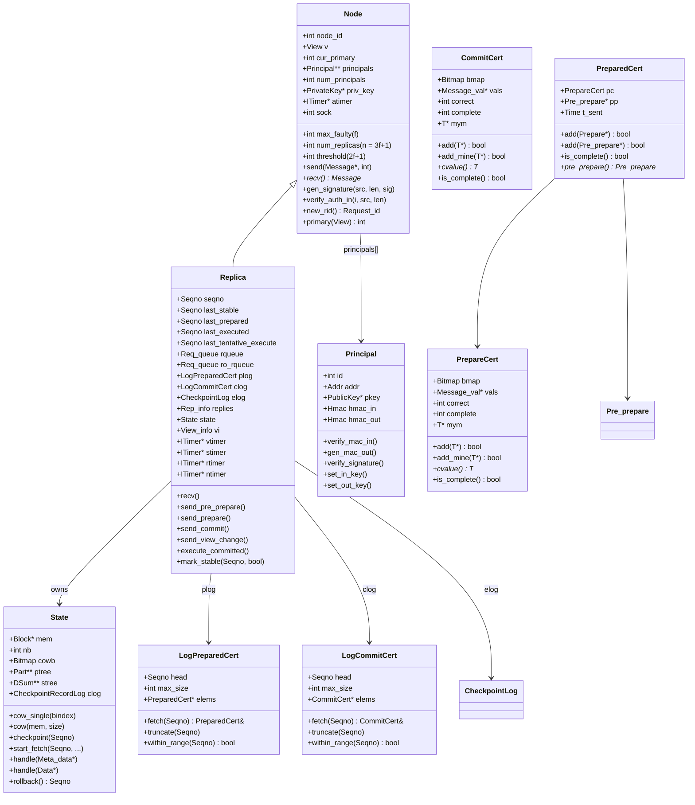
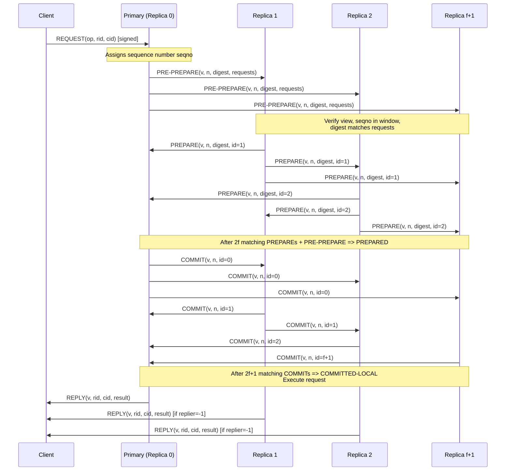
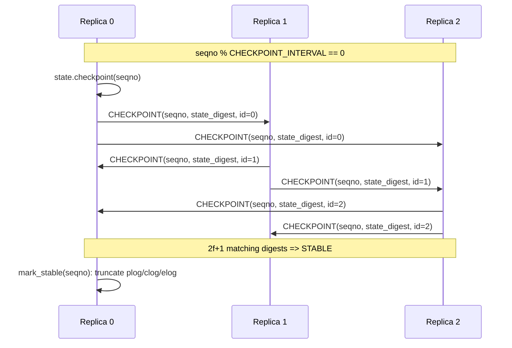
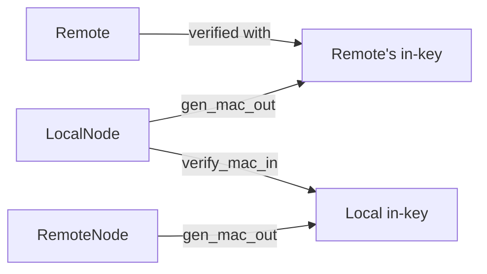
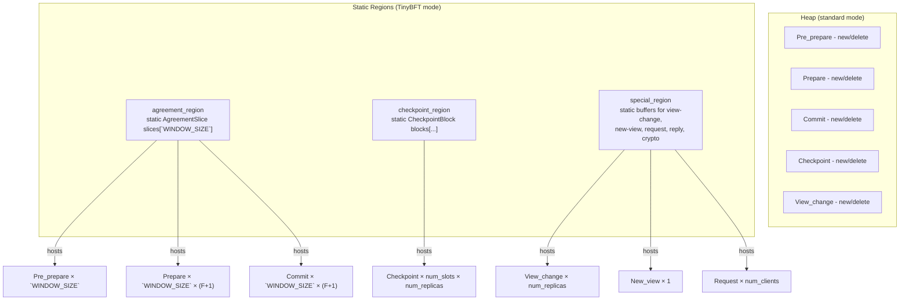
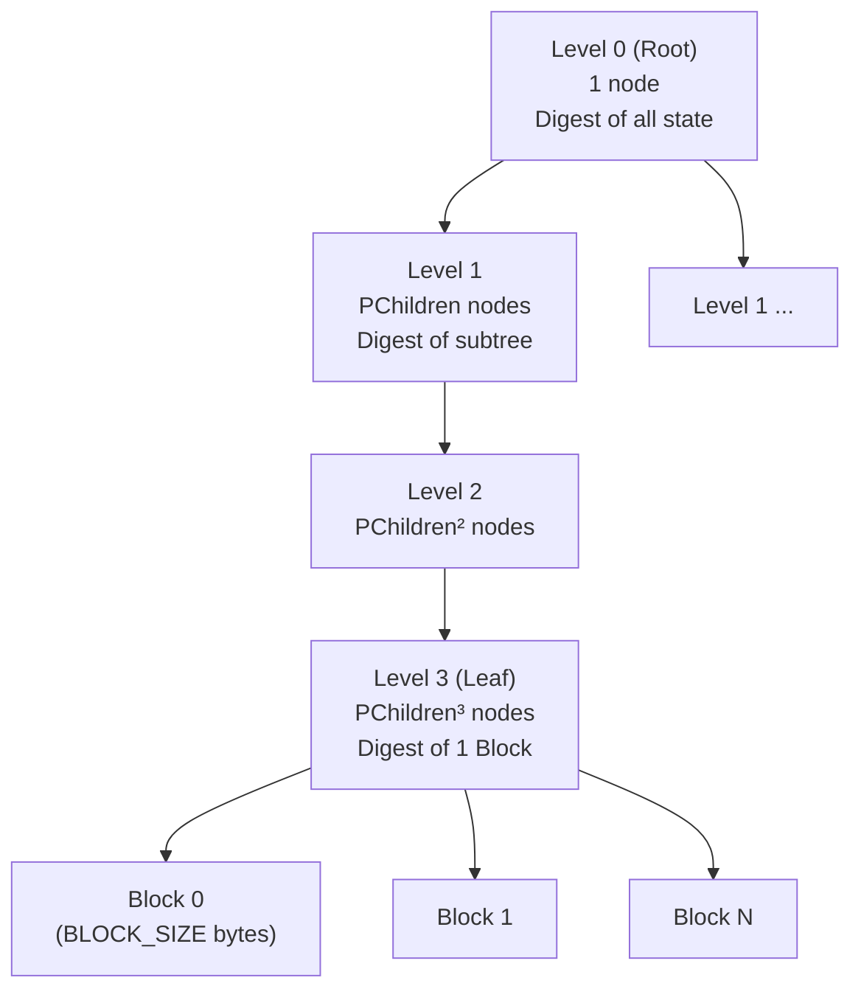
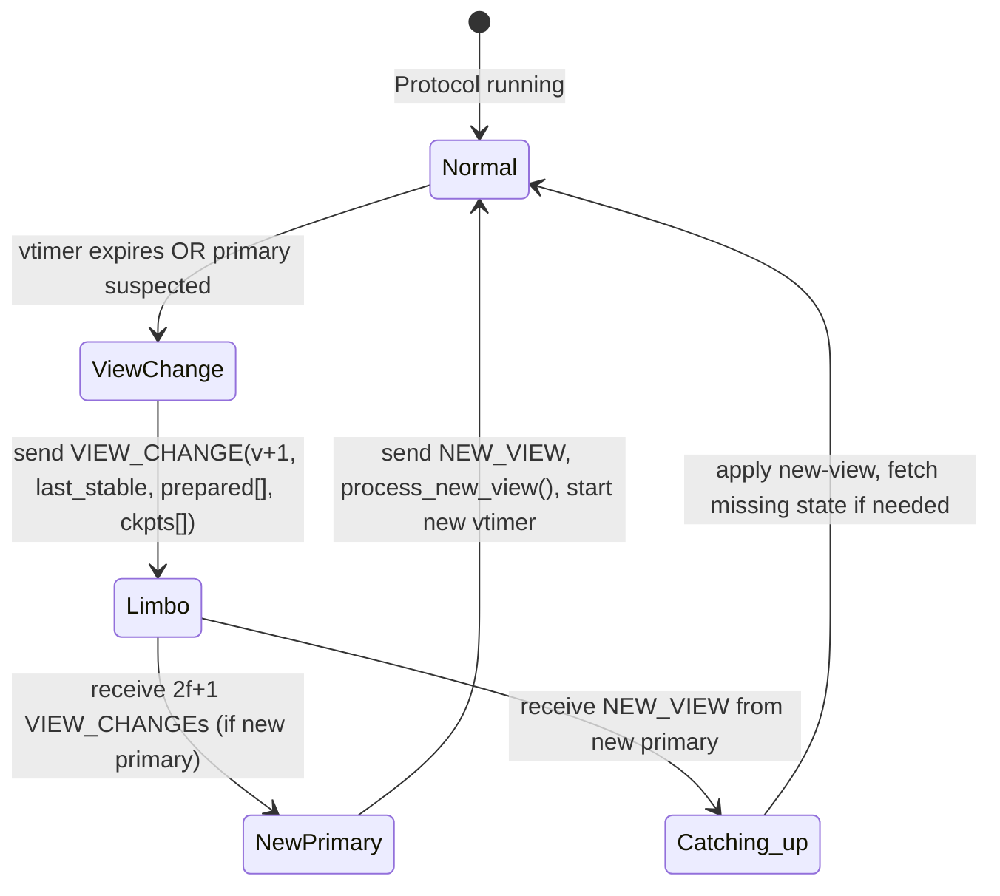
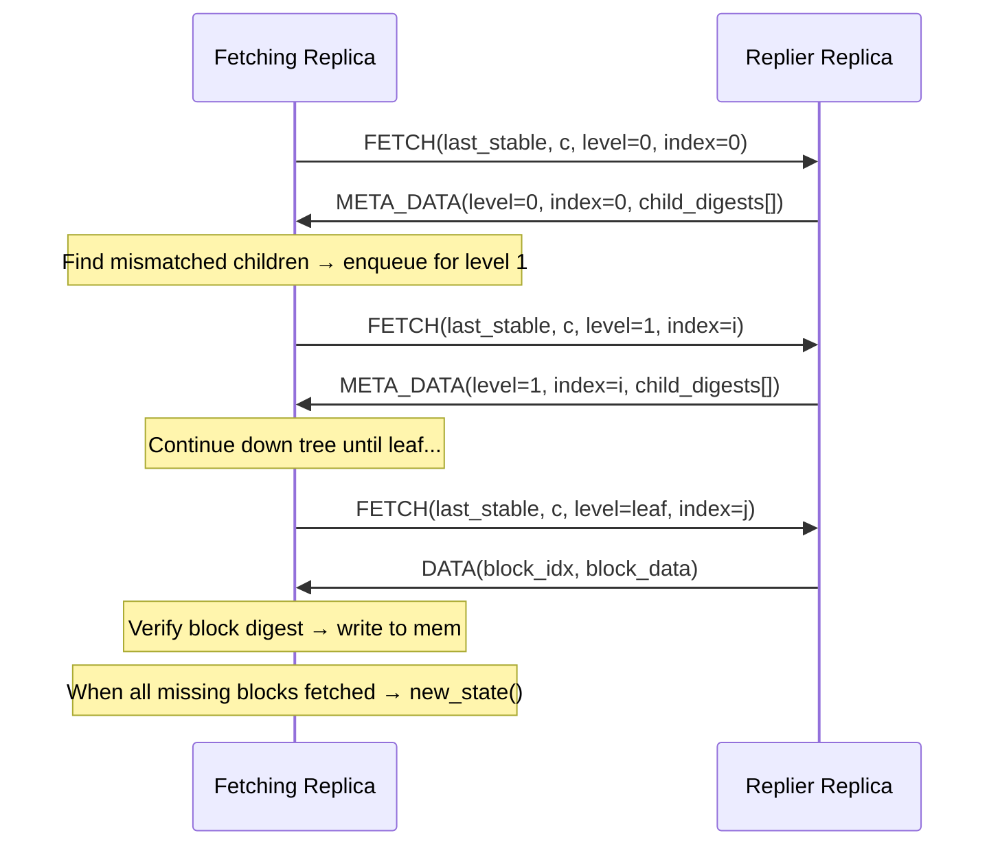
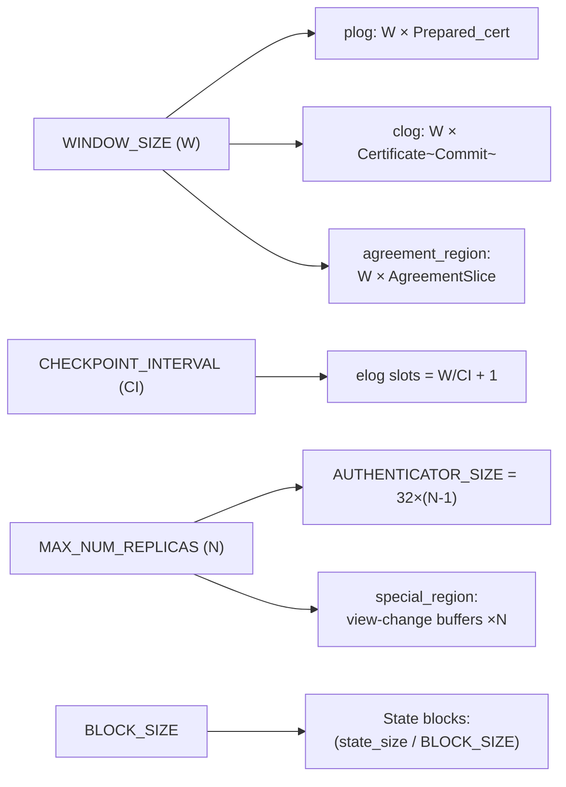

# TinyBFT Architecture & Developer Documentation

> TinyBFT is a memory-optimized Byzantine Fault-Tolerant (BFT) library for embedded systems, based on MIT's PBFT (`libbyz`). It replaces the `sfslite` crypto library with **MbedTLS** and introduces static memory regions to drastically reduce dynamic allocation.

---

## Table of Contents

1. [Overview](#1-overview)
2. [Class Hierarchy Diagram](#2-class-hierarchy-diagram)
3. [PBFT Protocol Flow](#3-pbft-protocol-flow)
4. [Message Types Reference](#4-message-types-reference)
5. [Core Classes](#5-core-classes)
   - [Node](#node)
   - [Replica](#replica)
   - [Principal](#principal)
   - [State](#state)
6. [Certificate & Log Abstractions](#6-certificate--log-abstractions)
7. [TinyBFT Memory Optimizations](#7-tinybft-memory-optimizations)
   - [agreement_region](#agreement_region)
   - [checkpoint_region](#checkpoint_region)
   - [special_region](#special_region)
   - [Dynamic Partition Tree](#dynamic-partition-tree)
8. [State Partitioning & Merkle Tree](#8-state-partitioning--merkle-tree)
9. [View Change Protocol](#9-view-change-protocol)
10. [State Transfer Protocol](#10-state-transfer-protocol)
11. [Build Configuration Reference](#11-build-configuration-reference)
12. [Runtime Configuration File Format](#12-runtime-configuration-file-format)
13. [Public API (`libbyz.h`)](#13-public-api-libbyzh)

---

## 1. Overview

TinyBFT implements a **PBFT (Practical Byzantine Fault Tolerance)** protocol where a cluster of `n = 3f + 1` replicas can tolerate up to `f` Byzantine-faulty nodes. Clients send requests to the cluster; the primary replica sequences them, and all replicas agree on the ordering via a three-phase protocol (Pre-Prepare → Prepare → Commit) before executing and replying.

### Key Design Goals

| Goal | Approach |
|------|----------|
| Tolerate `f` Byzantine faults | `n = 3f + 1` replicas, `2f + 1` quorums |
| Minimise dynamic memory | Static memory regions (`agreement_region`, `checkpoint_region`, `special_region`) |
| Embedded compatibility | MbedTLS, configurable `BLOCK_SIZE`, `WINDOW_SIZE`, `MAX_NUM_REPLICAS` |
| Correct state recovery | Merkle-tree over state blocks, fetch protocol, view-change safety |
| Low bandwidth | Authenticators (HMAC) instead of full RSA signatures in hot path |

---

## 2. Class Hierarchy Diagram



---

## 3. PBFT Protocol Flow

### 3.1 Normal-Case Operation (Three-Phase Commit)



### 3.2 Checkpoint Stabilization

Every `CHECKPOINT_INTERVAL` (default: 128) sequence numbers, all replicas broadcast a `CHECKPOINT` message with the state digest. When `2f + 1` matching Checkpoints are received, that checkpoint becomes **stable** and older log entries are garbage collected.



---

## 4. Message Types Reference

All messages extend `Message` and share a common wire header `Message_rep { short tag; short extra; int size; }`.

| Tag | Class | Fields | Direction | Purpose |
|-----|-------|--------|-----------|---------|
| 1 | `Request` | `od` (digest), `cid`, `rid`, `replier`, `command_size` | Client → Primary | Client operation request |
| 2 | `Reply` | `view`, `seqno`, `cid`, `rid` | Replica → Client | Response to client |
| 3 | `Pre_prepare` | `view`, `seqno`, `digest`, `rset_size`, `non_det_size` | Primary → Replicas | Phase 1: propose ordering |
| 4 | `Prepare` | `view`, `seqno`, `digest`, `id` | Replica → All | Phase 2: vote for ordering |
| 5 | `Commit` | `view`, `seqno`, `id` | Replica → All | Phase 3: commit ordering |
| 6 | `Checkpoint` | `seqno`, `digest`, `id` | Replica → All | Stable checkpoint announcement |
| 7 | `Status` | various | Replica → All | Periodic status summary |
| 8 | `View_change` | `v`, `ls`, `ckpts[]`, `n_reqs`, `prepared[]` | Replica → All | Trigger view change |
| 9 | `New_view` | `v`, `min`, `max`, `prepared[]` | New Primary → All | Commit new view |
| 10 | `View_change_ack` | `v`, `id`, `vc_id` | Replica → New Primary | Acknowledge view-change msg |
| 11 | `New_key` | authenticator | Replica → All | Rotate session keys |
| 12 | `Meta_data` | level, index, partition hashes | Replica → Fetching | State hash tree node |
| 13 | `Meta_data_d` | digests | Replica → Fetching | Directory-level state info |
| 14 | `Data` | block index, block data | Replica → Fetching | State block payload |
| 15 | `Fetch` | `last_stable`, `c`, `level`, `index` | Fetching → Replier | Request state transfer |
| 16 | `Query_stable` | `rid` | Replica → All | Estimate max stable seqno |
| 17 | `Reply_stable` | `seqno`, `rid` | Replica → Querier | Answer stable estimate |

### Message Wire Layout (Pre_prepare)

```
┌─────────────────────────────────────────────────────────────┐
│ Message_rep  │ tag=3 │ extra │ size (8-byte aligned)        │
├─────────────────────────────────────────────────────────────┤
│ Pre_prepare_rep                                             │
│   view (View/Seqno = int64)                                 │
│   seqno (Seqno)                                             │
│   digest (32 bytes, SHA-256)                                │
│   rset_size (int)                                           │
│   non_det_size (short)                                      │
├─────────────────────────────────────────────────────────────┤
│ request set [rset_size bytes]                               │
│   [ Request_rep | command | signature ] * N                 │
├─────────────────────────────────────────────────────────────┤
│ non-deterministic choices [non_det_size bytes]              │
├─────────────────────────────────────────────────────────────┤
│ authenticator (HMAC × num_replicas OR RSA sig)              │
└─────────────────────────────────────────────────────────────┘
```

---

## 5. Core Classes

### Node

**File:** `src/Node.h` / `src/Node.cc`

Base class for all participants (both replicas and clients). Owns the cryptographic identity of the local node and manages UDP socket communication.

**Key fields:**

| Field | Type | Description |
|-------|------|-------------|
| `node_id` | `int` | This node's identifier in the cluster |
| `max_faulty` (`f`) | `int` | Maximum byzantine faults tolerated |
| `num_replicas` (`n`) | `int` | `n = 3f + 1` |
| `threshold` | `int` | `2f + 1` (quorum size) |
| `v` | `View` | Current view number |
| `cur_primary` | `int` | `v % num_replicas` |
| `principals[]` | `Principal**` | All known principals (replicas first, then clients) |
| `priv_key` | `PrivateKey*` | Node's RSA private key (MbedTLS) |
| `atimer` | `ITimer*` | Authentication freshness timer |
| `sock` | `int` | UDP socket fd |

**Key methods (pseudocode):**

```
METHOD send(message m, integer destination):
    IF destination == All_replicas (-1):
        multicast m to all replicas via UDP
    ELSE:
        unicast m to principal[destination] via UDP

METHOD gen_signature(source_buffer src, integer length, OUT signature sig):
    sig ← RSA-SHA256_SIGN(src, length, priv_key)

METHOD gen_auth_in(source_buffer src, OUT buffer auth):
    auth ← HMAC-SHA256(src, principal[node_id].hmac_out_key)

METHOD gen_auth_out(destination_id i, source_buffer src, OUT buffer auth):
    auth ← HMAC-SHA256(src, principal[i].hmac_in_key)

METHOD verify_auth_in(sender_id i, source_buffer src, buffer auth) → boolean:
    expected ← HMAC-SHA256(src, principal[i].hmac_in_key)
    RETURN constant_time_compare(auth, expected)

METHOD verify_auth_out(destination_id i, source_buffer src, buffer auth) → boolean:
    expected ← HMAC-SHA256(src, principal[i].hmac_out_key)
    RETURN constant_time_compare(auth, expected)

METHOD new_rid() → Request_id:
    static_counter ← static_counter + 1
    RETURN (node_id << 48) | static_counter

METHOD primary(View v) → integer:
    RETURN v MOD num_replicas
```

---

### Replica

**File:** `src/Replica.h` / `src/Replica.cc`

The heart of the library. Extends `Node`. Manages the full PBFT state machine including: request queuing, the prepared/commit log, checkpoint management, view-change, state transfer, and recovery.

**Key state fields:**

| Field | Type | Description |
|-------|------|-------------|
| `seqno` | `Seqno` | Next outgoing sequence number (primary only) |
| `last_stable` | `Seqno` | Sequence number of last stable checkpoint |
| `last_prepared` | `Seqno` | Highest prepared seqno |
| `last_executed` | `Seqno` | Highest committed+executed seqno |
| `last_tentative_execute` | `Seqno` | Highest tentatively executed seqno |
| `rqueue` / `ro_rqueue` | `Req_queue` | R/W and read-only request queues |
| `plog` | `Log<Prepared_cert>` | Prepared certificates, one per seqno slot |
| `clog` | `Log<Certificate<Commit>>` | Commit certificates |
| `elog` | `CheckpointLog` (TinyBFT) or `Log<Certificate<Checkpoint>>` | Checkpoint certificates |
| `replies` | `Rep_info` | Last reply sent to each client |
| `state` | `State` | Manages copy-on-write and state fetch |
| `vi` | `View_info` | View-change protocol state |
| `vtimer` | `ITimer*` | View-change timeout |
| `stimer` | `ITimer*` | Status broadcast timer |
| `rtimer` | `ITimer*` | Recovery timer |
| `ntimer` | `ITimer*` | Null-request (keep-alive) timer |
| `se` | `Stable_estimator` | Estimates max stable checkpoint at any replica |

**Handler dispatch (pseudocode, via message tag):**

```
// Replica::recv() dispatches via gen_handle<T>(m):
ON MESSAGE m:
    SWITCH m.tag:
        CASE 1  (Request):         HANDLE_REQUEST(m)
        CASE 2  (Reply):           HANDLE_REPLY(m)
        CASE 3  (Pre_prepare):     HANDLE_PRE_PREPARE(m)
        CASE 4  (Prepare):         HANDLE_PREPARE(m)
        CASE 5  (Commit):          HANDLE_COMMIT(m)
        CASE 6  (Checkpoint):      HANDLE_CHECKPOINT(m)
        CASE 7  (Status):          HANDLE_STATUS(m)
        CASE 8  (View_change):     HANDLE_VIEW_CHANGE(m)
        CASE 9  (New_view):        HANDLE_NEW_VIEW(m)
        CASE 10 (View_change_ack): HANDLE_VIEW_CHANGE_ACK(m)
        CASE 11 (New_key):         HANDLE_NEW_KEY(m)
        CASE 12 (Meta_data):       HANDLE_META_DATA(m)
        CASE 13 (Meta_data_d):     HANDLE_META_DATA_D(m)
        CASE 14 (Data):            HANDLE_DATA(m)
        CASE 15 (Fetch):           HANDLE_FETCH(m)
        CASE 16 (Query_stable):    HANDLE_QUERY_STABLE(m)
        CASE 17 (Reply_stable):    HANDLE_REPLY_STABLE(m)
        DEFAULT:                   DISCARD(m)
```

**Sequence number window invariant:**
> A message is "in window" (`in_w(m)`) iff `last_stable < m.seqno <= last_stable + WINDOW_SIZE`

---

### Principal

**File:** `src/Principal.h` / `src/Principal.cc`

Represents a remote peer. Stores the peer's IP address, RSA public key, and symmetric HMAC session keys (in-key for messages received *from* this principal, out-key for messages *to* it).



Authentication flow (pseudocode):

```
// Outgoing message authentication:
METHOD principal.send_message(buffer msg):
    mac ← HMAC-SHA256(msg, this.hmac_out_key)
    APPEND mac TO msg
    SEND msg TO remote

// Incoming message verification:
METHOD principal.receive_message(buffer msg, buffer received_mac):
    expected ← HMAC-SHA256(msg, this.hmac_in_key)
    IF constant_time_compare(received_mac, expected) == FALSE:
        REJECT message
    ACCEPT message

// RSA signature path (for Request, View_change, etc.):
METHOD principal.sign_with_rsa(buffer msg):
    signature ← RSA-SHA256_SIGN(msg, priv_key)
    APPEND signature TO msg

METHOD principal.verify_rsa_signature(buffer msg, buffer signature, public_key):
    IF RSA-SHA256_VERIFY(msg, signature, public_key) == FALSE:
        REJECT message
    ACCEPT message

// Session key rotation:
METHOD principal.rotate_session_keys():
    new_key ← GENERATE_RANDOM_SYMMETRIC_KEY()
    encrypted ← RSA_ENCRYPT(new_key, remote.public_key)
    SEND New_key(encrypted) TO remote
    SET hmac_out_key ← new_key
```

---

### State

**File:** `src/State.h` / `src/State.cc`

Manages the replica's **application state** as a flat array of fixed-size `Block`s (default 4096 bytes each). Provides:

- **Copy-on-Write (CoW):** Before any write to a block, `cow_single(bindex)` saves a snapshot so the previous checkpoint can always be reconstructed.
- **Merkle-style Digest Tree:** `ptree` (partition tree of `Part` nodes) and `stree` (sum tree of digests) allow efficient incremental digest updates and fast detection of divergent state during fetch.
- **Checkpoint Snapshots:** `clog` holds `CheckpointRecord` entries (one per checkpoint interval) with digests and old block copies.
- **Fetch Protocol:** When fetching, `in_fetch_state()` is true; `Meta_data`, `Meta_data_d`, and `Data` messages are received to reconstruct the Merkle tree bottom-up.

**State methods (pseudocode):**

```
METHOD state.cow_single(block_index):
    IF cowb[block_index] == 0:
        SAVE current mem[block_index] TO clog.old_blocks
        SET cowb[block_index] ← 1

METHOD state.cow(memory_region mem, integer size):
    FOR each block i IN mem:
        cow_single(i)

METHOD state.checkpoint(Seqno seqno):
    FOR each block i WHERE cowb[i] == 1:
        digest[i] ← SHA256(mem[i])
        UPDATE stree bottom-up FROM changed digests
        UPDATE ptree WITH new stree values
    COMPUTE root_digest ← stree[0][0]
    STORE CheckpointRecord(seqno, root_digest, old_blocks) TO clog
    RESET cowb ← ALL_ZEROS

METHOD state.start_fetch(Seqno seqno, ...):
    SET in_fetch_state ← TRUE
    SELECT random replier replica r
    SEND FETCH(last_stable, seqno, level=0, index=0) TO r
    SET fetch_timeout ← 100ms

METHOD state.handle(Meta_data msg):
    FOR each child c IN msg.child_digests:
        IF local_digest(level+1, c.index) != c.digest:
            ENQUEUE FETCH for (level+1, c.index)
    IF no more children TO FETCH:
        RETURN  // done WITH this level

METHOD state.handle(Data msg):
    IF SHA256(msg.block_data) == msg.expected_digest:
        WRITE msg.block_data TO mem[msg.block_index]
        UPDATE stree AND ptree FOR this block
    IF all missing blocks FETCHED:
        CALL new_state()
        SET in_fetch_state ← FALSE

METHOD state.rollback() → Seqno:
    RESTORE mem FROM clog.old_blocks
    REBUILD stree AND ptree FROM RESTORED blocks
    RETURN last_stable_seqno
```

---

## 6. Certificate & Log Abstractions

### `Certificate<T>` (template)

**File:** `src/Certificate.h`

A quorum certificate: collects at most one message per replica sender, groups identical messages, and becomes **complete** once `complete` (default: `2f+1`) matching messages are received.

```
PREDICATE is_complete() → boolean:
    RETURN num_correct() >= complete
```

Internally stores distinct values in `vals[]` (up to `f+1` slots, since beyond that a quorum is guaranteed). Tracks which replica IDs have sent a message using a `Bitmap`.

**Certificate methods (pseudocode):**

```
METHOD Certificate.add(message m) → boolean:
    sender ← m.sender_id
    IF bmap[sender] == 1:
        RETURN FALSE  // already HAVE message FROM this sender
    IF m IS duplicate OF existing value IN vals:
        bmap[sender] ← 1
        INCREMENT correct counter FOR that value
        RETURN TRUE
    IF num_distinct_values < f + 1:
        STORE m AS new value IN vals
        bmap[sender] ← 1
        SET correct counter FOR this value ← 1
        RETURN TRUE
    RETURN FALSE  // no room FOR additional distinct values

METHOD Certificate.add_mine(message m) → boolean:
    SET mym ← m
    bmap[my_node_id] ← 1
    INCREMENT correct counter FOR this value
    RETURN TRUE

METHOD Certificate.cvalue() → message OR null:
    FOR each value v IN vals:
        IF v.correct_counter >= complete:
            RETURN v
    RETURN null

METHOD Certificate.is_complete() → boolean:
    RETURN num_correct() >= complete
```

Used as:
- `Certificate<Commit>` in `clog` (commit log)
- `Certificate<Checkpoint>` in `elog` (checkpoint log, standard mode)
- `Certificate<Reply>` for recovery replies

### `Prepared_cert`

**File:** `src/Prepared_cert.h`

Combines a `Pre_prepare*` with a `Certificate<Prepare>` (prepare certificate). The certificate is **complete** when:
- `pp != nullptr` (pre-prepare received)
- `pc.is_complete()` (at least `2f` matching prepares)
- `pp->match(pc.cvalue())` (prepare digests match pre-prepare digest)

**Prepared_cert methods (pseudocode):**

```
METHOD Prepared_cert.add(Prepare msg) → boolean:
    RETURN pc.add(msg)

METHOD Prepared_cert.add(Pre_prepare msg) → boolean:
    IF pp != NULL:
        RETURN FALSE  // already HAVE a pre-prepare
    pp ← msg
    SET t_sent ← current_time()
    RETURN TRUE

METHOD Prepared_cert.is_complete() → boolean:
    IF pp == NULL:
        RETURN FALSE
    IF pc.is_complete() == FALSE:
        RETURN FALSE
    RETURN pp.digest == pc.cvalue().digest

METHOD Prepared_cert.pre_prepare() → Pre_prepare:
    RETURN pp
```

### `Log<T>` (template)

**File:** `src/Log.h`

A circular buffer of `max_out` (= `WINDOW_SIZE`, default 256) entries indexed by sequence number. Access uses `seqno & mask` (power-of-2 modulo). Used as:

- `Log<Prepared_cert> plog` — per-seqno prepared certs
- `Log<Certificate<Commit>> clog` — per-seqno commit certs
- `Log<Certificate<Checkpoint>> elog` — per-checkpoint checkpoint certs (standard mode)

**Log methods (pseudocode):**

```
// Circular buffer indexing: mask = max_out - 1 (power-of-2 optimization)
METHOD Log.fetch(Seqno n) → T reference:
    index ← (head_index + (n - head)) MOD max_out
    // Equivalently: index ← (head_index + (n - head)) & mask
    RETURN elems[index]

METHOD Log.truncate(Seqno new_head):
    // Garbage-collect entries below new_head
    FOR each entry e FROM head TO new_head - 1:
        CLEAR elems[e]
        DEALLOCATE internal resources OF e
    head ← new_head
    head_index ← head_index MOD max_out

METHOD Log.within_range(Seqno seqno) → boolean:
    RETURN (seqno > head) AND (seqno <= head + max_out)
```

---

## 7. TinyBFT Memory Optimizations

TinyBFT mode (enabled with `-DTINY_BFT=1`) replaces dynamic heap allocation of protocol messages with **static, pre-allocated memory regions**. This is critical for embedded systems with no or limited heap.



**Defined compile-time flags:**

| Flag | Effect |
|------|--------|
| `STATIC_LOG_ALLOCATOR` | Use static regions instead of `Log_allocator` heap |
| `ALTERNATIVE_CHECKPOINT_LOG` | Use `CheckpointLog` instead of `Log<Certificate<Checkpoint>>` |
| `ALTERNATIVE_CHECKPOINT_RECORDS` | Use `CheckpointRecordLog` instead of `Log<Checkpoint_rec>` in State |
| `DYNAMIC_PARTITION_TREE` | Compute partition tree dimensions at runtime from state size |

### `agreement_region`

**File:** `src/agreement_region.h` / `src/agreement_region.cc`

A static circular buffer of `AgreementSlice[WINDOW_SIZE]` entries. Each slice holds one `PreparedCert` (1 Pre_prepare + F+1 Prepares) and one `CommitCert` (F+1 Commits).

```cpp
struct AgreementSlice {
    PreparedCert prepared_cert;   // Pre_prepare + (F+1) Prepares
    CommitCert   commit_cert;     // (F+1) Commits
};
static AgreementSlice slices[max_out];  // max_out = WINDOW_SIZE
```

Indexing uses `cert_index(n) = (head_index + (n - head)) % max_out`. The `truncate(new_head)` function advances the head when sequences are garbage collected after a stable checkpoint.

**API (pseudocode):**

```
METHOD agreement_region.new_pre_prepare(View v, Seqno n, Req_queue req) → Pre_prepare:
    ASSERT within_range(n)
    slice ← slices[(n - head) % max_out]
    pp ← slice.prepared_cert.alloc_pre_prepare(v, n, req)
    RETURN pp

METHOD agreement_region.load_pre_prepare(Seqno n) → Pre_prepare:
    IF within_range(n) == FALSE:
        RETURN NULL
    slice ← slices[(n - head) % max_out]
    RETURN slice.prepared_cert.pp

METHOD agreement_region.store_pre_prepare(Pre_prepare pp):
    n ← pp.seqno
    slice ← slices[(n - head) % max_out]
    slice.prepared_cert.pp ← pp

METHOD agreement_region.load_prepare(Seqno n, integer i) → Prepare:
    IF within_range(n) == FALSE:
        RETURN NULL
    slice ← slices[(n - head) % max_out]
    RETURN slice.prepared_cert.pc.vals[i]

METHOD agreement_region.store_prepare(Prepare p, integer i):
    n ← p.seqno
    slice ← slices[(n - head) % max_out]
    slice.prepared_cert.pc.add_at_index(p, i)

METHOD agreement_region.load_commit(Seqno n, integer i) → Commit:
    IF within_range(n) == FALSE:
        RETURN NULL
    slice ← slices[(n - head) % max_out]
    RETURN slice.commit_cert.vals[i]

METHOD agreement_region.store_commit(Commit c, integer i):
    n ← c.seqno
    slice ← slices[(n - head) % max_out]
    slice.commit_cert.add_at_index(c, i)

METHOD agreement_region.truncate(Seqno new_head):
    FOR each seqno s FROM head TO new_head - 1:
        slice ← slices[(s - head) % max_out]
        CLEAR slice.prepared_cert
        CLEAR slice.commit_cert
    head ← new_head

METHOD agreement_region.within_range(Seqno seqno) → boolean:
    RETURN (seqno >= head) AND (seqno < head + max_out)
```

### `checkpoint_region`

**File:** `src/checkpoint_region.h` / `src/checkpoint_region.cc`

Static storage for `Checkpoint` messages per sequence number slot, indexed by `(seqno / checkpoint_interval) % num_slots`. Also stores "above window" checkpoints (from ahead-of-window replicas) per replica ID.

**API (pseudocode):**

```
METHOD checkpoint_region.load_checkpoint(Seqno seqno, integer i) → Checkpoint:
    slot ← (seqno / checkpoint_interval) % num_slots
    RETURN blocks[slot].checkpoints[i]

METHOD checkpoint_region.store_checkpoint(Checkpoint c, integer i):
    seqno ← c.seqno
    slot ← (seqno / checkpoint_interval) % num_slots
    blocks[slot].checkpoints[i] ← c

METHOD checkpoint_region.load_above_window(integer replica_id) → Checkpoint:
    RETURN above_window_slots[replica_id].checkpoint

METHOD checkpoint_region.store_above_window(Checkpoint c):
    replica_id ← c.sender_id
    above_window_slots[replica_id].checkpoint ← c

METHOD checkpoint_region.truncate(Seqno seqno):
    // Clear checkpoint slots below the new stable seqno
    FOR each slot s WHERE s.seqno < seqno:
        CLEAR blocks[s]
```

### `special_region`

**File:** `src/special_region.h` / `src/special_region.cc`

Stores all remaining protocol messages that do not fit into the hot-path `agreement_region`:

| Sub-region | Contents |
|-----------|----------|
| Checkpoints | Overflow checkpoint storage |
| View | `View_change[num_replicas]`, `View_change_ack[num_replicas][num_replicas]`, `New_view` |
| Crypto | `New_key` message |
| Requests | `Request[max_num_clients]`, `Reply[num_clients]` |

### Dynamic Partition Tree

**File:** `src/Partition.h` / `src/Partition.cc`

Standard mode uses compile-time constants (`PLevels=4`, `PChildren=256`). With `DYNAMIC_PARTITION_TREE`, the partition tree dimensions are computed at runtime from the actual number of state blocks:

```
// Dynamic partition tree dimension calculation (pseudocode):
CONSTANT PChildren ← (Max_message_size - sizeof(Meta_data_rep)) / sizeof(Part_info)

METHOD compute_PLevels(total_blocks) → integer:
    nodes_at_level ← 1
    level ← 0
    WHILE nodes_at_level < total_blocks:
        nodes_at_level ← nodes_at_level * PChildren
        level ← level + 1
    RETURN level

PLevels ← compute_PLevels(num_state_blocks)
```

This allows the library to adapt to the actual state size without wasting memory for a fixed deep tree when the state is small.

---

## 8. State Partitioning & Merkle Tree

The state is subdivided into a Merkle-like tree for efficient digest computation and incremental state transfer.



- `ptree[l][i]` stores `Part` (digest + version) for partition `(l, i)`.
- `stree[l][i]` stores `DSum` (sum of child digests) for fast incremental update.
- Copy-on-Write bitmap `cowb`: bit `i` = 0 means block `i` must be copied before modification; bit = 1 after copy.
- When `checkpoint(seqno)` is called: blocks with modified cow-bits get new digests, stree/ptree updated, overall state digest computed.

---

## 9. View Change Protocol

Triggered when `vtimer` expires (replica suspects primary is faulty).



**`View_change` message contents** (`View_change_rep`):
- `v`: new view number being proposed
- `ls`: sequence number of sender's last stable checkpoint
- `ckpts[n_ckpts]`: digests of all checkpoints in `[ls, ls + max_out]`
- `prepared[prepared_size]`: bitmap of which seqnos are prepared
- `req_info[n_reqs]`: `{lv, v, digest}` for each request referenced

**New primary selection:** `new_primary = v % num_replicas`

**`View_info`** (`src/View_info.h`) manages (pseudocode):

```
METHOD View_info.collect_view_change(View_change msg):
    sender ← msg.sender_id
    IF already_received[sender]:
        RETURN
    stored_views[sender] ← msg
    already_received[sender] ← TRUE

METHOD View_info.has_enough_view_changes() → boolean:
    count ← 0
    FOR each replica r:
        IF already_received[r]:
            count ← count + 1
    RETURN count >= 2f + 1

METHOD View_info.compute_min_max_seqno() → (integer min, integer max):
    min ← MAXIMUM OF all received_view_change.ls
    max ← MINIMUM OF all received_view_change.ls + max_out
    RETURN (min, max)

METHOD View_info.construct_new_view() → New_view:
    nv ← ALLOCATE New_view
    nv.view ← current_view + 1
    nv.min ← compute_min_max_seqno().min
    nv.max ← compute_min_max_seqno().max
    nv.prepared ← MERGE all stored_views[].prepared
    RETURN nv

METHOD View_info.verify_new_view(New_view nv) → boolean:
    IF nv.view != expected_view:
        RETURN FALSE
    IF nv.min > nv.max:
        RETURN FALSE
    FOR each prepared entry p IN nv.prepared:
        IF NOT EXISTS matching view_change with p:
            RETURN FALSE
    RETURN TRUE
```

---

## 10. State Transfer Protocol

When a replica falls behind or detects corruption, it fetches missing state:



The replier is selected randomly and rotated if no response arrives within 100ms (`retrans_fetch`).

---

## 11. Build Configuration Reference

| CMake Variable | Default | Description |
|----------------|---------|-------------|
| `TINY_BFT` | off | Enable TinyBFT static memory optimizations |
| `MAX_MESSAGE_SIZE` | 16384 | Maximum UDP message size in bytes (must fit view-change messages) |
| `MAX_REPLY_SIZE` | 1240 | Maximum reply payload size (< `MAX_MESSAGE_SIZE`) |
| `BLOCK_SIZE` | 4096 | State page/block size (power of 2, ≤ page size) |
| `MAX_NUM_REPLICAS` | 32 | Max replicas supported (affects data structure sizing) |
| `WINDOW_SIZE` | 256 | Number of in-flight sequence numbers |
| `CHECKPOINT_INTERVAL` | 128 | Seqno interval between checkpoints |
| `MAX_NUM_CLIENTS` | 1 | Max clients (TinyBFT static regions) |
| `MAX_REQUEST_SIZE` | derived | Max command payload |
| `DISABLE_MULTICAST` | off | Use unicast instead of multicast |
| `PRINT_PERF_STATISTICS` | off | Enable `Statistics.cc` cycle counters |
| `PRINT_MEM_STATISTICS` | off | Enable custom `malloc` tracking |
| `MBEDTLS_INCLUDE_PATH` | system | Override MbedTLS include path |

### Compile-Time Validation

The build system enforces correct configuration via static assertions:

| Assertion | Requirement |
|-----------|-------------|
| `BLOCK_SIZE` | Must be a power of two (e.g., 4096) |
| `WINDOW_SIZE > CHECKPOINT_INTERVAL` | Protocol requires window larger than checkpoint interval |
| `max_view_change_size <= MAX_MESSAGE_SIZE` | View-change messages must fit in UDP packets |
| `max_new_view_size <= MAX_MESSAGE_SIZE` | New-view messages must fit in UDP packets |
| `max_request_size <= MAX_MESSAGE_SIZE` | Request messages must fit in UDP packets |

If any assertion fails, compilation will error with a clear message indicating the constraint violation.

### Memory Impact Summary



---

## 12. Runtime Configuration File Format

Config file read in `Node::Node()` on startup. Lines are:

```
<service_name>          # arbitrary ASCII string, e.g., "generic"
<f>                     # max faulty replicas (integer)
<auth_timeout_ms>       # authentication freshness timeout
<num_nodes>             # total nodes (replicas + clients)
<multicast_ip>          # multicast group IP (e.g., 234.5.6.8)
<host1> <ip1> <port1> <pub_key1_path>   # replica 0
<host2> <ip2> <port2> <pub_key2_path>   # replica 1
...                                      # (num_nodes total node lines)
<view_change_timeout_ms>
<status_timeout_ms>
<recovery_timeout_ms>
```

Replica nodes are listed first (indices `0..n-1`), then clients (`n..num_nodes-1`). The reading replica matches its own entry by IP address (and optionally `port` if non-zero).

---

## 13. Public API (`libbyz.h`)

### Client API

```
// Initialize client
FUNCTION Byz_init_client(configuration_file, private_config_file, port) → integer:
    READ config files TO SET node_id, f, n, principals
    INITIALIZE UDP socket ON port
    LOAD cryptographic keys
    RETURN 0 ON success, -1 ON failure

// Allocate a request buffer
FUNCTION Byz_alloc_request(Byz_req request, integer size) → integer:
    ALLOCATE buffer OF size bytes
    SET request.contents ← buffer
    SET request.size ← size
    RETURN 0 ON success, -1 ON failure

// Set request contents, then send:
FUNCTION Byz_send_request(Byz_req request, boolean read_only) → integer:
    IF read_only:
        SET request type ← READ_ONLY
    ELSE:
        SET request type ← READ_WRITE
    SIGN request WITH client private key
    SEND request TO primary replica
    RETURN 0 ON success

// Wait for f+1 matching replies
FUNCTION Byz_recv_reply(Byz_rep reply) → integer:
    WAIT UNTIL f + 1 matching replies received:
        RECEIVE message FROM replicas
        VERIFY each reply signature
        IF reply matches (same view, rid, result):
            INCREMENT match_count
    IF match_count >= f + 1:
        SET reply ← agreed_reply
        RETURN 0
    RETURN -1 ON timeout OR mismatch

// Convenience: send + recv in one call
FUNCTION Byz_invoke(Byz_req request, Byz_rep reply, boolean read_only) → integer:
    result ← Byz_send_request(request, read_only)
    IF result != 0:
        RETURN result
    RETURN Byz_recv_reply(reply)

// Cleanup
PROCEDURE Byz_free_request(Byz_req request):
    FREE request.contents
    SET request ← NULL

PROCEDURE Byz_free_reply(Byz_rep reply):
    FREE reply.contents
    SET reply ← NULL

PROCEDURE Byz_reset_client():
    CLEAR pending requests
    CLEAR received replies
    RESET client state
```

### Replica API

```
// Initialize replica
FUNCTION Byz_init_replica(config, private_config, memory, memory_size,
                          exec_callback, comp_ndet_callback, ndet_max_len,
                          recv_reply_callback, port) → integer:
    READ config files TO SET node_id, f, n, principals
    INITIALIZE UDP socket ON port
    LOAD cryptographic keys
    SET state memory ← memory, size ← memory_size
    REGISTER exec_callback FOR request execution
    REGISTER comp_ndet_callback FOR non-deterministic choices
    REGISTER recv_reply_callback FOR client replies
    INITIALIZE plog, clog, elog, rqueue, ro_rqueue
    SET seqno ← 1, last_stable ← 0, last_executed ← 0
    RETURN 0 ON success, -1 ON failure

// Notify library before modifying state
PROCEDURE Byz_modify(memory, size):
    CALL state.cow(memory, size)

MACRO Byz_modify1(memory):
    block_index ← memory / BLOCK_SIZE
    CALL state.cow_single(block_index)

MACRO Byz_modify2(memory, size):
    FOR each block i COVERED BY [memory, memory+size):
        CALL state.cow_single(i)

// Run the replica event loop
PROCEDURE Byz_replica_run():
    WHILE TRUE:
        message ← recv()
        IF message IS NOT NULL:
            dispatch TO appropriate handler(message)
        IF timer expired:
            HANDLE timer event

// Statistics
PROCEDURE Byz_reset_stats():
    RESET all performance counters

PROCEDURE Byz_print_stats():
    PRINT current performance metrics TO stdout
```

### Callback Signatures

```
// Execute a committed request
FUNCTION exec(Byz_req request, Byz_rep reply, Byz_buffer ndet, integer client_id, boolean read_only) → integer:
    // Called BY the library WHEN a request IS committed
    PARSE request.contents
    IF read_only AND request IS NOT read_only:
        RETURN -1
    PERFORM state operations (CALL Byz_modify AS needed)
    COMPUTE result
    SET reply.contents ← result
    SET reply.size ← result_length
    RETURN 0 ON success

// Compute non-deterministic choices FOR a sequence number
FUNCTION comp_ndet(Seqno seqno, Byz_buffer ndet):
    // Called BY the library BEFORE executing seqno
    // Application MUST fill ndet WITH deterministic choices
    COMPUTE non_deterministic_data(seqno)
    COPY data TO ndet.contents
    SET ndet.size ← actual_data_length
```

### `Byz_buffer` / `Byz_req` / `Byz_rep`

```
STRUCTURE Byz_buffer_t:
    integer   size       // number OF valid bytes IN contents
    pointer   contents   // pointer TO the data buffer
    pointer   opaque     // library-internal use

TYPE Byz_buffer AS Byz_buffer_t
TYPE Byz_req    AS Byz_buffer  // alias FOR request buffers
TYPE Byz_rep    AS Byz_buffer  // alias FOR reply buffers
```

---

## Appendix: Key Type Aliases (`types.h`)

| Typedef | Underlying | Description |
|---------|-----------|-------------|
| `Seqno` | `long long` | Protocol sequence number |
| `View` | `Seqno` | View number (same type) |
| `Request_id` | `unsigned long long` | Unique per-client request ID |
| `Addr` | `struct sockaddr_in` | Network address |
| `Long` | `long long` | Signed 64-bit |
| `ULong` | `unsigned long long` | Unsigned 64-bit |

---

*Generated from source code analysis of TinyBFT v0.0.1. All class/field names are exact matches to the source.*
